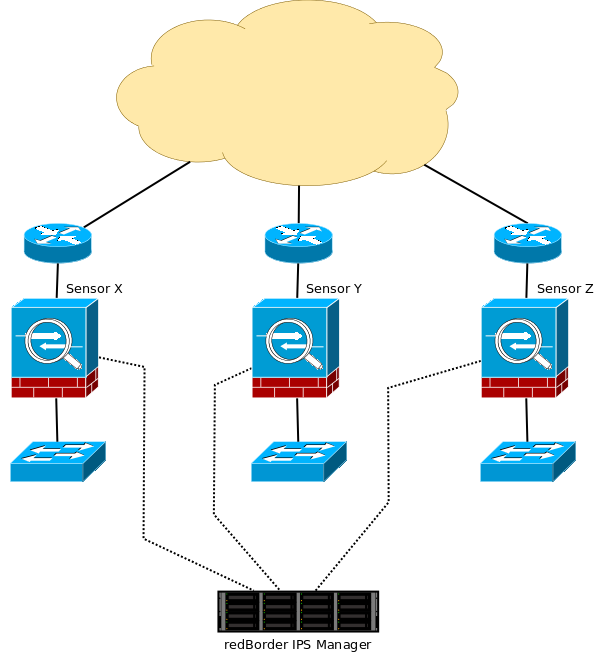

# Capítulo 1. ¿Qué es RedBorder?

**Redborder** es la última plataforma abierta, activa y escalable de Ciberseguridad y Análisis en tiempo real de Tráfico de Red (NTA). Se basa en la tecnología Big Data para empresas y proveedores de servicios.

Su capacidad para ingerir, analizar y reportar grandes cantidades de datos se ha desarrollado y probado en entornos de muy alta demanda, así como el Análisis de Tráfico de Red, la Ciberseguridad o el análisis e informe de conexiones a través de redes inalámbricas en distintos lugares.

La plataforma unifica las diferentes fuentes de datos proporcionadas por las aplicaciones y las sondas. Además, incluye una serie de características comunes: paneles e informes personalizables, correlación, motores de análisis, gestión de usuarios y almacenamiento en capas.

Las aplicaciones se encuentran dentro de la plataforma y se pueden instalar como si fueran complementos. Estos se centran en digerir nuevos tipos de datos.

Las sondas se sitúan fuera de la plataforma, pero se gestionan desde ella y su función es la creación de nuevos tipos de datos y capacidades de inspección.

Dependiendo de las aplicaciones integradas en la plataforma, el usuario verá una u otras opciones en la barra de menú. Las aplicaciones que están disponibles en esta nueva versión de Redborder son las siguientes:

- Business Intelligence
- Malware
- Tráfico
- Intrusión
- Monitor
- Social
- Vault
- Movilidad
- Informes

## 1.1 Escenario básico para la instalación de Redborder

Un escenario básico típico propuesto por la solución consiste en un conjunto de sensores dispuestos en diferentes puntos sensibles de la red de la organización que conectarán con un Manager o clúster de managers para su gestión y monitorización.

Dichos puntos están formados por enlaces de red, llamados segmentos, por los que circulará el tráfico sensible y que el sensor analizará de manera más o menos transparente, en función del modo de funcionamiento configurado (IPS/IDS o Flow).

Para la planificación de la instalación de los sensores, se deberán tener en cuenta algunos aspectos fundamentales:

- **Los segmentos bypass** (interfaces específicas de red pareadas, normalmente con soporte bypass) se interpondrán en medio del tráfico a analizar.
- **Las interfaces de gestión** (en forma de bonding) para acceso remoto tanto desde equipos normales como desde el Manager.
- **Las interfaces de acceso IPMI para la gestión remota del hardware** (conexión SOL ó Serial Over Lan, iKVM y comandos IPMI como inicio, reinicio y apagado).

Para el **Manager** no es necesario un hardware específico, la única condición es **la existencia de una o más interfaces de red.**

!!! note "Nota"

    En caso de que se haya creado un **clúster** son necesarias dos interfaces de red: una para la red de gestión (Management IP Address) y otra para la red de sincronismo (Sync IP address).

!!! danger "Advertencia"

    Es **importante** que primero se realice la configuración del Manager (o clúster de managers) antes de configurar los sensores.
    
    El Manager debe estar operativo y en una red accesible a los sensores. Algunos de los procesos de configuración de los sensores dependen del acceso al Manager.

Escenario básico para la instalación del Manager

## 1.2 Estructura de la interfaz de usuario del menú de instalación

### 1.2.1 Menú, submenú y línea de comandos

Estructura de la interfaz de usuario del menú de instalación

#### *Menú*

En el margen izquierdo de la pantalla encontrará un listado con las opciones disponibles. Para seleccionar cualquiera de ellas solo debe introducir en la línea en la que figura Selection, el número o letra que corresponda a la opción que desea elegir.

#### *Submenú*

En el margen izquierdo de la pantalla encontrará un listado con las opciones disponibles. Para seleccionar cualquiera de ellas solo debe introducir en la línea en la que figura Selection, el número o letra que corresponda a la opción que desea elegir.

#### *Línea de comandos / Selector de opciones*

En el margen superior, y separado del menú y submenú gráficamente, encontramos el área en el que se deberán indicar las selecciones en la línea en la que figura `Selection` e introducir los comandos o datos que se soliciten para ejecutar las acciones pertinentes. En esta zona visualizaremos la fecha y la hora del sistema (por defecto en UTC).

### 1.2.2 Selección de opciones

#### *Opciones predeterminadas*

En algunos casos, el sistema mostrará una serie de opciones predeterminadas. Si se trata de la respuesta a una pregunta, la opción definida por defecto se visualizará en mayúsculas.

Selección de opciones predeterminadas

#### *Opciones disponibles en el menú del asistente de instalación de RedBorder*

- Selección de opción por defecto: pulse **Enter**.
- Otras opciones: introduzca la letra o comando que corresponda.
- Salir: cuando quiera salir de una pantalla para regresar al menú inicial seleccione la opción **quit**, introduciendo la letra **q**.
- Aplicar cambios: para guardar las modificaciones realizadas y aplicar los cambios, seleccione la opción **apply** introduciendo la letra **a**.

Opciones disponibles en el menú del asistente de instalación de Redborder

!!! warning "Importante"

    **Es necesario "aplicar" para activar los cambios**
    
    Si visualiza este mensaje deberá seleccionar la opción **a**. En caso contrario, el sistema no guardará ni aplicará las modificaciones realizadas.
