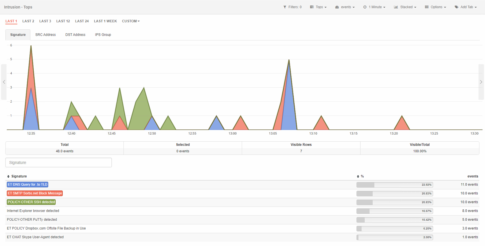
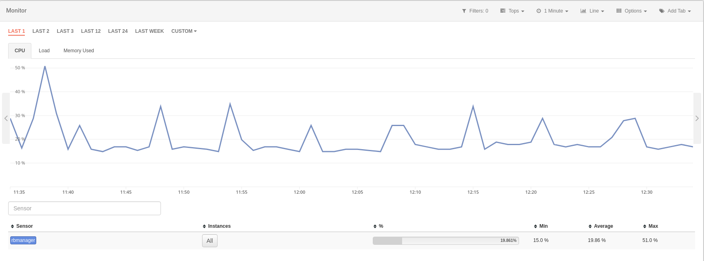

# Apps Overview

Redborder offers maximum network visibility thanks to the many options for data representation and visualization provided by our Apps.

The platform has an App (a.k.a module) for each functionality. Each one uses different technologies and has an independent interface. All modules need a sensor to provide them with data.

## Traffic

The **Traffic** module uses NetFlow to extract information about all the sensor's traffic. The module provides information such as IPs, protocols, locations, and much more.

## Intrusion

The **Intrusion** module uses data from the sensor or IPS sensors to display intrusion events based on Snort rules. Also, thanks to the different views included in Redborder, it is possible to analyze the packets that matched the rule specification.

## Monitor

The **Monitor** module uses data from SNMP, Redfish, and IPMI protocols to display the status of the infrastructure.

## Vault

The **Vault** module uses syslog data to provide information about events from different sources, such as category, target, event action, and more.

It is also possible to enhance the capabilities of the Vault module through extensions that add compatibility with other manufacturers.

## Mobility

The **Mobility** module provides location information for AP sensors in the network. It can be used to show how people move around in a building.

