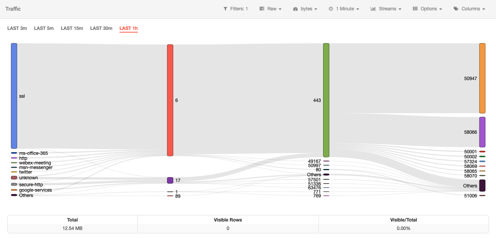

# Menú de Apps

En esta sección se explican las opciones comunes que podemos encontrar en varias aplicaciones.

## Menú Superior

### Filtros

Permiten a los usuarios aislar una parte de la información para una inspección detallada. En esta pestaña, se puede ver el número de filtros aplicados y realizar acciones sobre ellos:

- Búsqueda avanzada.
- Crear una alarma.
- Crear un widget.

### Agregaciónes

Las diferentes métricas en las que se pueden mostrar los datos. Cada aplicación tiene sus propias agregaciones.

### Granularidad

Indica el grado de detalle temporal que puede mostrarse en la información. El valor mínimo para la granularidad es de un minuto.

### Tipo de Gráfico

Muestra los diferentes tipos de gráficos entre los que se pueden visualizar los datos. Los tipos de gráficos disponibles varían según la vista seleccionada:

**Área**: gráfico que superpone los datos en un grupo de elementos pertenecientes al atributo seleccionado, haciendo que el tráfico total sea la suma del tráfico por atributo.

**Líneas**: gráfico que superpone los datos en un grupo de elementos pertenecientes al atributo seleccionado; en este caso, el área no se muestra, sino que el gráfico se representa por una línea.

**Barras**: superpone datos en un grupo de elementos pertenecientes al atributo seleccionado, siendo el total la suma de valores para cada uno de esos elementos. En este caso, los datos se representan en barras.

**Barras Apiladas**: proporciona en el mismo gráfico los datos obtenidos para cada uno de los elementos incluidos en el atributo seleccionado, de modo que se pueden ver los resultados de IPs independientes, sensores, etc., representados en barras.

**Acumulado**: muestra de manera comparativa los datos de cada uno de los atributos seleccionados en el mismo gráfico.

**Streams**: gráfico disponible solo en vista de RAW.

### Opciones

Las opciones varían dependiendo de la vista seleccionada.

- **Mostrar total/Ocultar total**: al seleccionar esta opción, se muestra en el gráfico el valor de todo el tráfico diferenciado recibido o transmitido por cada uno de los atributos que se pueden consultar. Cuando esta opción está activa, aparece la opción de "Ocultar total". Disponible en la vista superior y única.
- **Exportar a CSV**: proporciona la opción de exportar a CSV incluyendo los datos correspondientes al atributo seleccionado; se puede establecer un límite de filas a incluir en el archivo. Solo disponible para vistas Top y Única.
- **Máquina del Tiempo**: al seleccionar esta opción, el usuario puede ver los datos como si los estuviera visualizando en el último día y hora especificados. Disponible para todas las vistas excepto Datos Brutos.
- **Ordenar agregaciones**: permite cambiar el orden de las agregaciones.
- **Ordenar columnas**: disponible para la vista de Datos Brutos. Permite cambiar el orden de las columnas.
- **Guardar tabs como predeterminadas**: las pestañas abiertas se guardarán como las pestañas predeterminadas.
- **Iniciar Recarga**: disponible para la vista de Datos Brutos. Activa la cuenta regresiva para recargar los datos; a la izquierda de la barra de sección, aparece una cuenta regresiva que indica el tiempo para la recarga. En cualquier momento, se puede detener seleccionando Detener Recarga.
- **Exportar a PNG**: Exporta el gŕafico en formato PNG.

### Añadir Pestaña

Los eventos recibidos por Redborder Manager consisten en dimensiones. Los valores dados en cada columna pueden entenderse como datos específicos de eventos que realmente proporcionan información. Estos se denominan "pestañas" o "dimensiones".

## Selector de Tiempo

Filtra eventos en función de períodos de tiempo. Los períodos definidos en la plataforma son Última Hora, 2 horas, 3 horas, 12 horas, 24 horas y Última Semana.

Existe la posibilidad de seleccionar un período de tiempo diferente al predeterminado que se ofrece. Dependiendo de las necesidades del usuario, se puede realizar una selección personalizada del período utilizando la opción Personalizado. Más adelante se especifica el procedimiento para realizar un filtro de tiempo personalizado.

## Pestañas

Navegando por cada una de las pestañas, se pueden explorar valores detallados asociados a la dimensión seleccionada.

El usuario puede cambiar el orden en el que se muestran las pestañas en cualquier momento. Para ello, simplemente debe arrastrar y soltar la pestaña en la posición deseada.
    
## Gráfico

En esta área, los datos se muestran según la vista y el tipo de gráfico seleccionados. Al colocar el mouse sobre cualquiera de los puntos que conforman el gráfico, se muestra un cuadro de diálogo con información detallada para ese momento en el tiempo, la agregación y el atributo.

## Tabla

### Resumen

Debajo del área de **Gráfico**, hay un resumen de todos los datos mostrados, tanto en la vista como en la tabla. En el siguiente orden, este resumen indica el valor de agregación total de todos los datos cargados, el valor de agregación total de todos los datos cargados y seleccionados, el número de filas de datos cargados y el porcentaje del valor agregado de los datos cargados respecto al total de datos.

### Búsqueda

Permite buscar por pestaña. Las búsquedas se convierten automáticamente en filtros.

### Tabla de Datos

Muestra valores clasificados por el tipo de atributo seleccionado. Por ejemplo, cada fila podría mostrar cada una de las IPs de origen (Columna/Atributo: Dirección SRC) con el porcentaje de bytes detallados (agregación) que ese elemento consume dentro de la red.

Para el análisis aislado de uno o más elementos de esta barra (seleccionándolos como filtro), haga clic en el elemento que desea filtrar y luego presione el botón correspondiente que aparecerá junto a la búsqueda.
