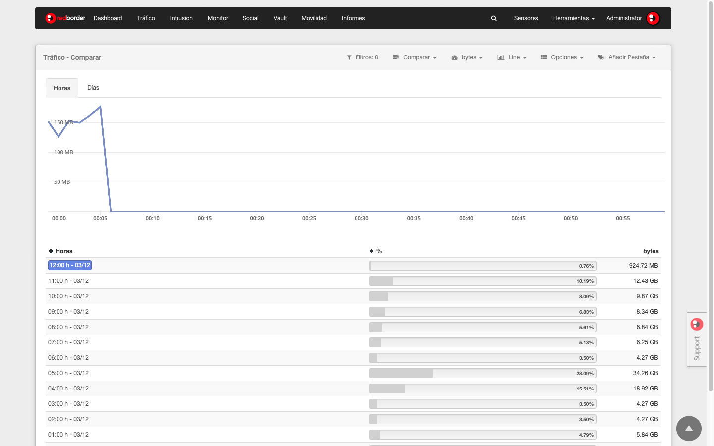

# Vistas de las Apps

Las vistas ofrecen múltiples perspectivas para mostrar los datos asociados con el tráfico de red.

La mayoría de las aplicaciones de Redborder contienen las siguientes vistas (pueden variar dependiendo de la aplicación):

- **Tops**: Agregación de eventos basada en una unidad para mostrar los más destacados. Suma el total de datos de diferentes eventos para mostrarlos como un solo evento.
- **RAW**: Ver todos los eventos de datos en bruto, clasificados por dimensiones y franjas horarias.
- **Comparar**: Comparar intervalos de tiempo para analizar diferencias en el estado de la red.
- **Único**: Muestra los diferentes elementos que han interactuado con la red según la dimensión.

## Tops

La vista de **Tops** nos permite ver cuáles eventos fueron los más destacados al seleccionar el intervalo de tiempo. Lo que visualizamos en el gráfico es la suma de todos estos eventos mostrados como un solo evento. Si colocas el cursor sobre cada uno de estos "picos" o **Tops**, verás el desglose del evento por fecha, hora y tipo de dimensión o atributo que estás consultando.

## Raw

Esta vista proporciona eventos de datos en bruto; por lo tanto, verás el número total de eventos por atributo segmentados por franjas horarias.

La vista RAW puede mostrar gráficos en períodos de los últimos 3, 5, 15, 30 o 60 minutos.

## Comparar

Esta vista muestra la evolución del uso de la red al comparar dos intervalos de tiempo. Esta comparación puede hacerse por horas o días en intervalos de 5 minutos, asegurando un máximo grado de detalle.

## Único

A través de la vista **Único**, el usuario puede obtener información sobre los diferentes elementos que han interactuado al menos una vez en un período de tiempo específico. Al colocar el cursor sobre cualquier punto del gráfico, el usuario obtendrá el total de elementos únicos para el período de tiempo seleccionado.

**Agrupar por** nos permite agrupar los datos mostrados en el gráfico en función de un atributo determinado. Esta opción facilita el filtrado y la clasificación de elementos según los criterios de análisis que necesitemos.

