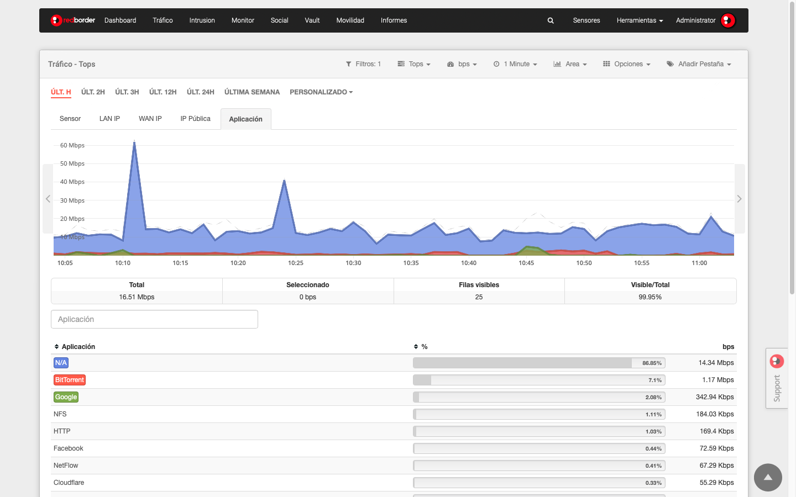
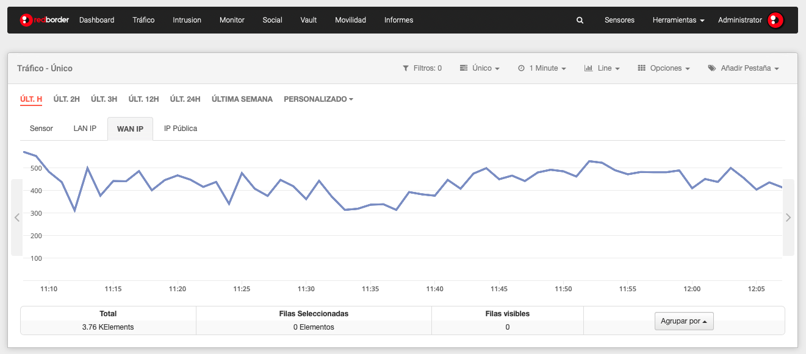

# Apps Views

Views provide multiple perspectives to display data associated with network traffic.

Most of the Redborder Apps contain the following views (they may vary depending on the App):

- **Tops**: Aggregation of events based on a unit to display the most outstanding ones. It sums up the total data of different events to show them as a single event.
- **Raw**: View all raw data events, classified by dimensions and time slots.
- **Compare**: Compare time intervals to analyze differences in the network's state.
- **Unique**: Displays the different elements that have interacted with the network according to the dimension.

## Tops

The **Tops** view allows us to see which events were the most prominent as we select the time interval. What we visualize in the chart is the sum of all these events shown as a single event. If you hover over each of these "peaks" or **Tops**, you'll see the event breakdown by date, time, and type of dimension or attribute you are checking.

## Raw

This view provides raw data events; therefore, you will see the total number of events per attribute segmented by time slots.

The Raw view can provide graphs in periods of the last 3, 5, 15, 30, or 60 minutes.

## Compare

This view gives the evolution of network usage when comparing two time intervals. This comparison can be done for hours or days at 5-minute intervals, ensuring a maximum degree of detail.

## Unique

Through the **Unique** view, the user can obtain information about the different elements that have interacted, at least once within a specific period of time. When you place the mouse over any point of the graph, the user will get the total unique elements result for the selected time period.

**Group by** allows us to group the data displayed on the chart based on a given attribute. This option provides filtering and classification of elements according to the analysis criteria we need.

