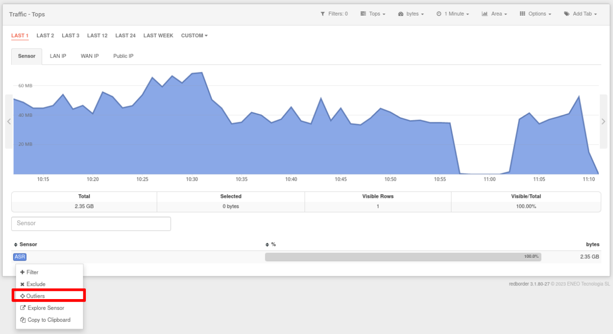
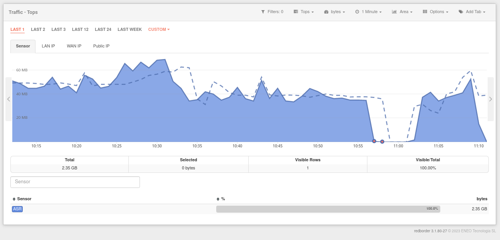
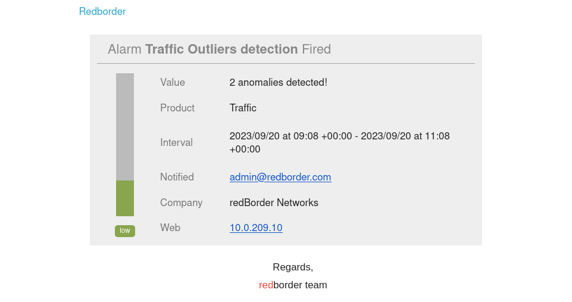

# Detección de Anomalías

## Activación de la Detección de Anomalías

Activa la detección de anomalías desde Configuración General -> Anomalías. En la vista de "Tops" de cada módulo, aparecerá la opción "Anomalías" en el menú desplegable de eventos.

El sistema realizará la detección de anomalías y actualizará el gráfico con los resultados.

En el gráfico resultante, la línea de puntos corresponde a la predicción, mientras que los círculos representan las anomalías detectadas.

Al pasar el cursor sobre el gráfico, se muestran el valor real, el valor esperado y el valor de predicción.

## Automatización de la Detección de Anomalías

Para automatizar este proceso, es posible crear alarmas en el sistema que notificarán al usuario cuando ocurran anomalías. Para hacerlo, haz clic en **Herramientas -> Alarmas** y ajusta los parámetros de la alarma, habilitando la opción **Activar Anomalías**, configurando la Ventana de Tiempo y las condiciones o filtros en los cuales realizar la detección.

Si se ha configurado la notificación por correo electrónico, el usuario recibirá una notificación por correo cuando se active la alarma.

