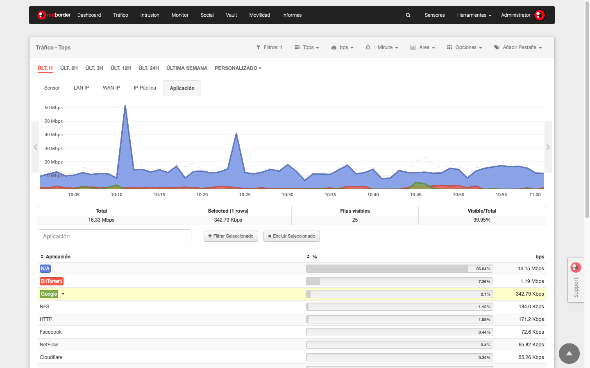

# Filtros

La función de Filtros en el submenú de la aplicación ofrece una variedad de opciones para ayudar a los usuarios a visualizar eventos según sus necesidades específicas de análisis.

## Opciones de filtrado

- **Zoom de Filtro**: Enfoca los eventos dentro de un marco de tiempo seleccionado, proporcionando una vista ampliada en función del tiempo.
- **Filtro Seleccionado**: Permite filtrar elementos específicos directamente en la tabla.
- **Búsqueda Avanzada**: Establece condiciones de búsqueda complejas, actuando como un filtro personalizable.

## Acciones de filtrado

- **Filtros Guardados**: Muestra una lista de filtros guardados previamente para un acceso rápido.
- **Crear una Alarma**: Permite a los usuarios establecer alarmas basadas en filtros activos, activando notificaciones para criterios seleccionados.
- **Crear un Widget**: Genera un widget basado en los criterios de búsqueda especificados, el cual puede agregarse a paneles de control o informes.

## Filtrar eventos por tiempo

Aislar eventos para períodos específicos permite un análisis detallado de los datos asociados a atributos seleccionados. Existen cinco métodos disponibles para filtrar por tiempo.

### Filtro de Período de Tiempo

El Filtro de Período de Tiempo es un método rápido para mostrar solo los eventos dentro de un marco de tiempo predefinido. Los usuarios pueden seleccionar opciones dentro de las pestañas del filtro de la línea de tiempo, lo que proporciona una forma sencilla de refinar la vista de datos por períodos específicos.

### Zoom de Filtro

Para seleccionar manualmente un período de tiempo, haga clic en un punto inicial en el gráfico y arrastre hasta el punto final, soltando en el momento deseado. Esta acción permite hacer zoom en el marco de tiempo seleccionado, ofreciendo una vista ampliada del período en el gráfico.

Después de hacer zoom, aparece una nueva opción en el submenú: **Zoom de Filtro**.

### Filtro Personalizado

La opción **Personalizado** en el **Selector de Tiempo** permite a los usuarios definir un rango de tiempo único arrastrando el mouse a través de un mes específico o rango de interés. Después de establecer el rango, solo los datos de este intervalo aparecen en la tabla a continuación.

Para aplicar el filtro, haga clic en **Enviar**.

### Búsqueda Avanzada

Para un filtrado detallado, use la **Búsqueda Avanzada** en la pestaña de Filtros. Esta función permite a los usuarios especificar múltiples condiciones y atributos, ajustando la búsqueda a criterios exactos como fechas de inicio y fin, así como valores de atributos.

- Agregar regla de búsqueda: haga clic en (+)
- Eliminar regla de búsqueda: haga clic en (-)

Una vez configurado, puede guardar los criterios de búsqueda como un filtro, lo que lo hace disponible en Ver **Filtros Guardados** en el menú de filtros. Para cargar un filtro guardado, haga clic en **Ver Filtros Guardados**, seleccione el filtro y agréguelo.

### Filtro de Dimensión

El filtrado basado en atributos se puede aplicar de dos maneras:

- **Búsqueda**: Ingrese el valor del atributo y presione Enter. El atributo se agrega automáticamente a la lista de filtros. Se pueden incluir múltiples valores.
- **Selección de Columnas en la Tabla**: Seleccione una o más filas en la tabla para filtrar los datos por elementos específicos. Para seleccionar múltiples filas, haga clic en las filas adicionales; para anular la selección, haga clic nuevamente en ellas.

Una vez seleccionadas, aparecen opciones para incluir o excluir los elementos gráficos y datos de la tabla:

- **Filtro Seleccionado**: Reincorpora los datos seleccionados.
- **Excluir Seleccionado**: Excluye los datos seleccionados.

Para selecciones individuales, hay opciones de filtrado adicionales disponibles:

- Haga clic en el nombre del sensor para incluir o excluir datos, indicado por un cambio de color correspondiente a la vista de datos.

- Opciones del menú desplegable junto a cada elemento de la tabla:
    - **Filtrar**: Incluye el elemento.
    - **Excluir**: Excluye el elemento.
    - **Copiar al portapapeles**: Copia el valor seleccionado para su uso posterior.
