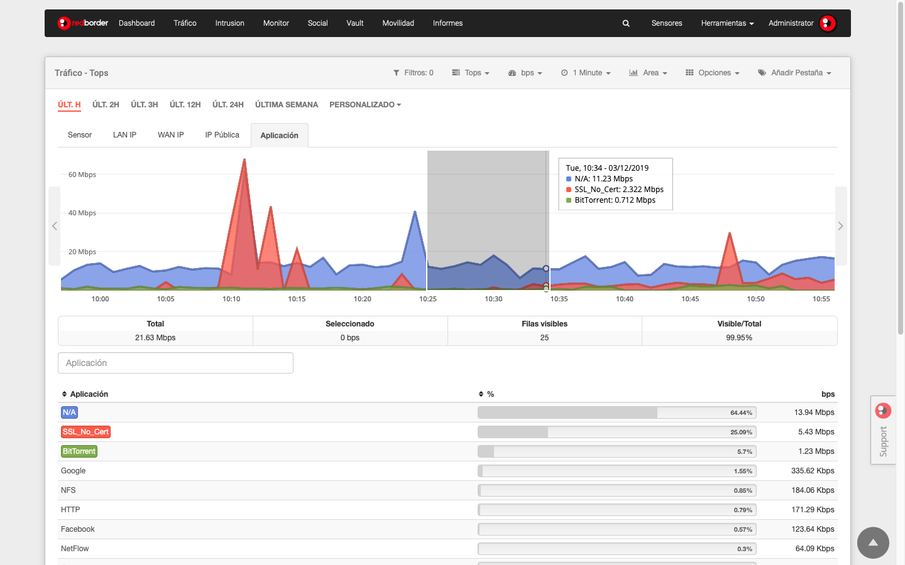
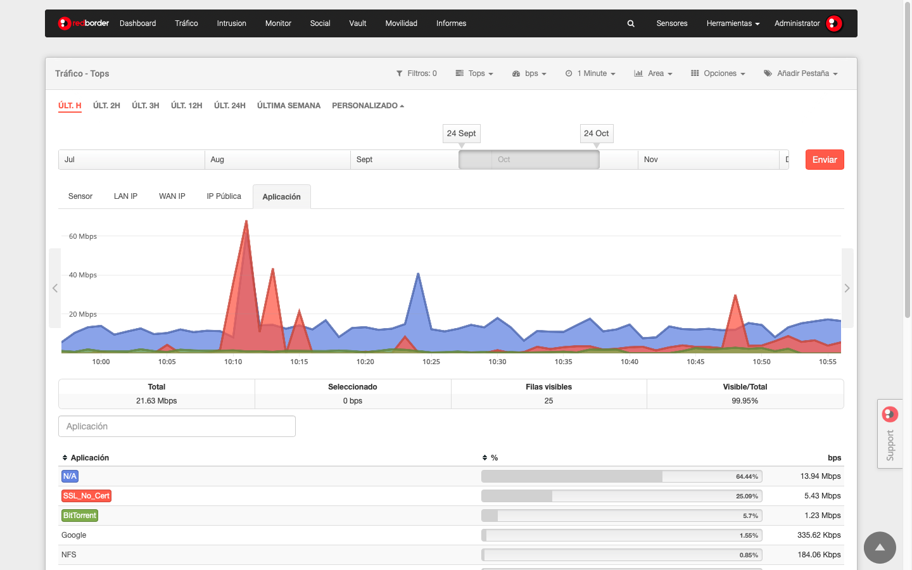

# Filters

The Filters feature in the app submenu offers a variety of options to help users view events based on their specific analysis needs.

## Filtering options

- **Filter Zoom**: Focuses on events within a selected time frame, providing a zoomed-in, time-based view.
- **Filter Selected**: Enables filtering specific elements directly within the table.
- **Advanced Search**: Sets complex search conditions, acting as a customizable filter.

## Filtering Actions

- **Saved Filters**: Displays a list of previously saved filters for quick access.
- **Create an Alarm**: Allows users to set alarms based on active filters, triggering notifications for selected criteria.
- **Create a Widget**: Generates a widget based on the specified search criteria, which can then be added to dashboards or reports.

## Filter events by time

Isolating events for specific time periods allows for in-depth analysis of data associated with selected attributes. There are five methods available to filter by time.

### Time Period Filter

The Time Period Filter is a quick method to display only events within a predefined time frame. Users can select options within the timeline filter tabs, which provide a straightforward way to refine data view by specific periods.

### Zoom Filter

To manually select a time period, click on a starting point in the graph and drag to the endpoint, releasing at the desired point in time. This action zooms into the selected timeframe, offering an expanded view of the period on the graph.

After zooming in, a new submenu option, **Filter Zoom**, becomes available.

### Custom Filter

The **Custom** option in the **Time Selector** allows users to define a unique time range by dragging the mouse across a specific month or range of interest. After setting the range, only data from this interval appears in the table below.

To apply the filter, click Submit.

### Advanced search

For detailed filtering, use the **Advanced Search** under the Filters tab. This feature enables users to specify multiple conditions and attributes, tailoring the search to exact criteria such as start and end dates, as well as attribute values.

- *Add search rule*: click (+)
- *Delete search rule*: click (-)

Once configured, you can save the search criteria as a filter, making it available under **View Saved Filters** or **Saved Filters** in the filter menu. To load a saved filter, click View Saved Filters, select the filter, and add it.

### Dimension filter

Attribute-based filtering can be applied in two ways:

- **Search**: Enter the attribute value and press Enter. The attribute is then automatically added to the filter list. Multiple values can be included.
- **Column Selection in the Table**: Select one or more rows in the table to filter data by specific elements. To multi-select, click additional rows; deselect by clicking them again.

Once selected, options appear to include or exclude the graphical elements and table data:

- **Filter Selected**: Re-includes selected data.
- **Exclude Selected**: Excludes selected data.

For single selections, additional filter options are available:

- Click the sensor name to include or exclude data, indicated by a color change corresponding to the data view.

- Dropdown menu options next to each table item:
    - **Filter**: Includes the element.
    - **Exclude**: Excludes the element.
    - **Copy to clipboard**: Copies the selected value for future use.
