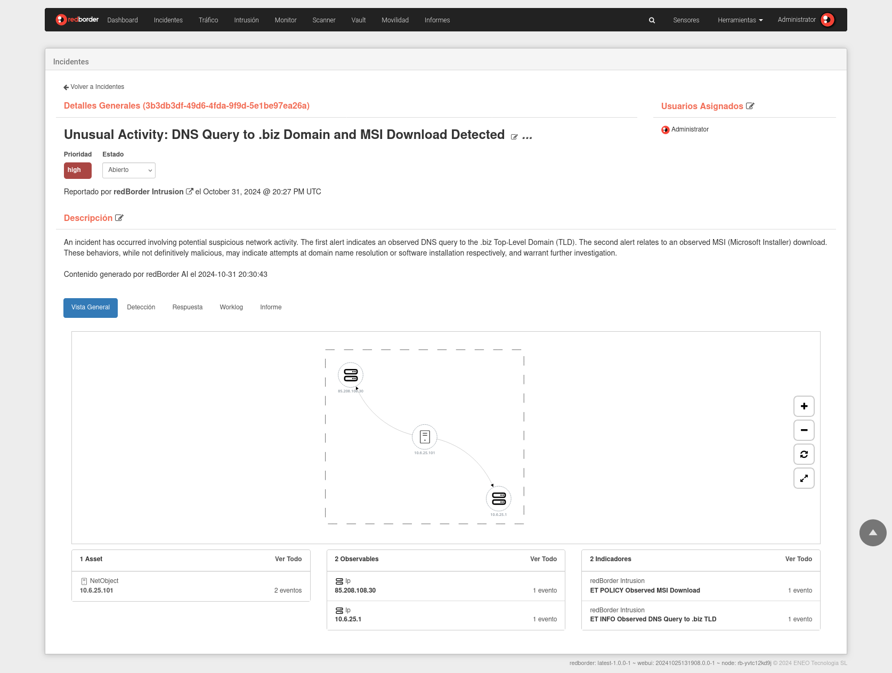
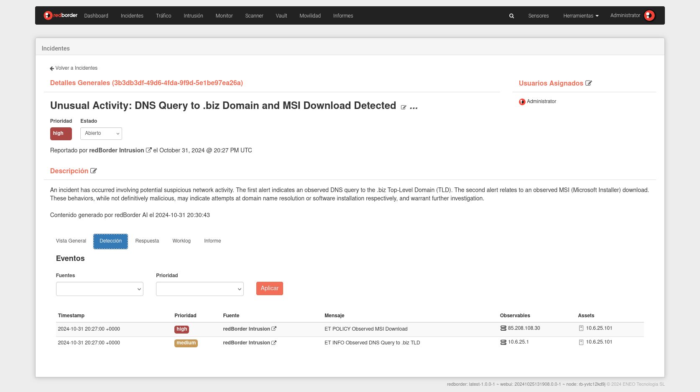
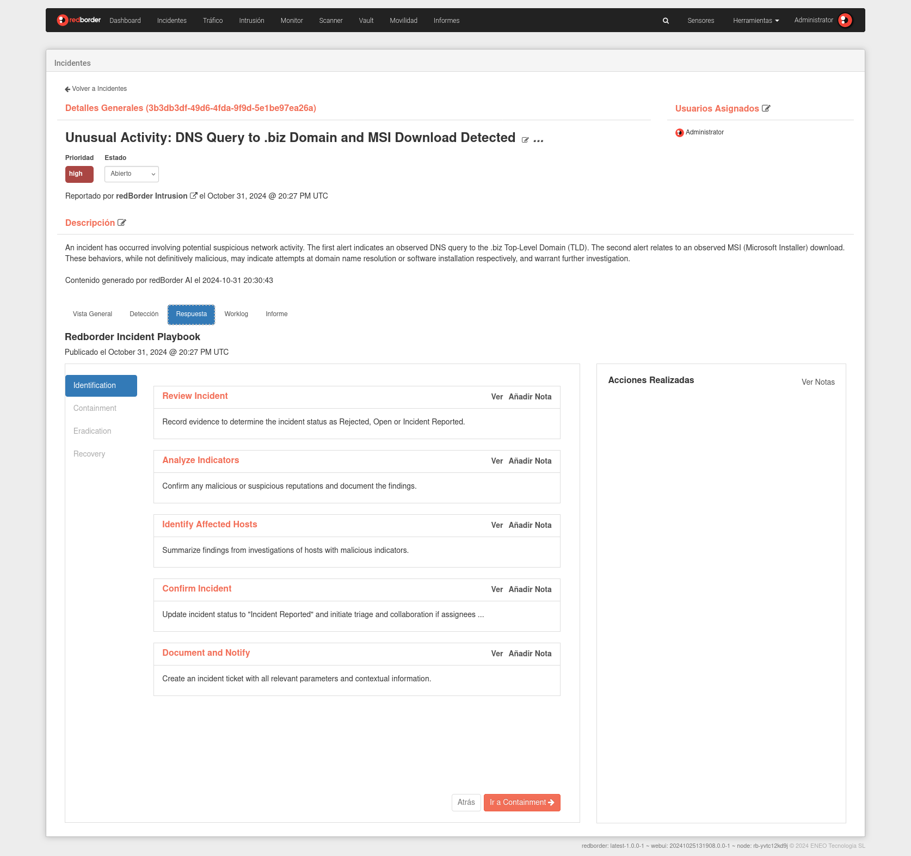

# Detalles del Incidente

## Overview del Incidente

Esta vista proporciona información detallada sobre el incidente, permitiendo a los usuarios documentar cada paso del proceso de respuesta.

### Overview

La sección de Resumen resume la información clave del incidente, mostrando:

- **Activos** involucrados
- **Observables** identificados
- **Indicadores** vinculados al incidente

Un gráfico interactivo visualiza las relaciones entre los observables, permitiendo a los usuarios comprender rápidamente sus conexiones.

### Detección

La sección de **Detección** enumera los eventos relevantes y sus observables y activos que contribuyeron al incidente, proporcionando una visión de cómo fue identificado.

### Respuesta

La sección de **Respuesta** presenta un **playbook**, una guía paso a paso adaptada al tipo de incidente. Los playbooks aseguran un enfoque sistemático de respuesta, con tareas organizadas por fase. Cada tarea incluye una descripción, espacio para comentarios de los usuarios y un marcador de finalización.

En este ejemplo, el playbook contiene cuatro fases:

- **Identificación**
- **Contención**
- **Erradicación**
- **Recuperación**

Cada fase enumera las tareas que deben completarse secuencialmente. Los usuarios pueden documentar sus acciones y marcar las tareas como realizadas.

### Worklog

El **Worlog** documenta todas las acciones realizadas por los usuarios en el incidente. Los usuarios pueden ver, filtrar y añadir comentarios manualmente según sea necesario.

### Búsqueda y Filtro del Worklog

Las entradas del Worklog se pueden filtrar por Tipo y Usuario y ordenar por fecha. Los tipos de registros incluyen:

- **Cambios en el Incidente**: Registros generados por el sistema para actualizaciones de estado y acciones de los usuarios.
- **Acciones de Respuesta**: Registros añadidos por el usuario durante las actividades de investigación y respuesta.
- **Notas**: Notas creadas por el usuario para información adicional.

Los usuarios pueden añadir notas al worklog haciendo clic en **Añadir Nota**, lo que abre un editor de texto. El editor permite:

- Inserción de enlaces
- Bloques de código y formato de texto
- Otras opciones de formato

### Report

Genera el informe del incidente usando Redborder AI.

Haz click en **Ver el Informe de incidentes** para generar una versión en PDF del informe.

