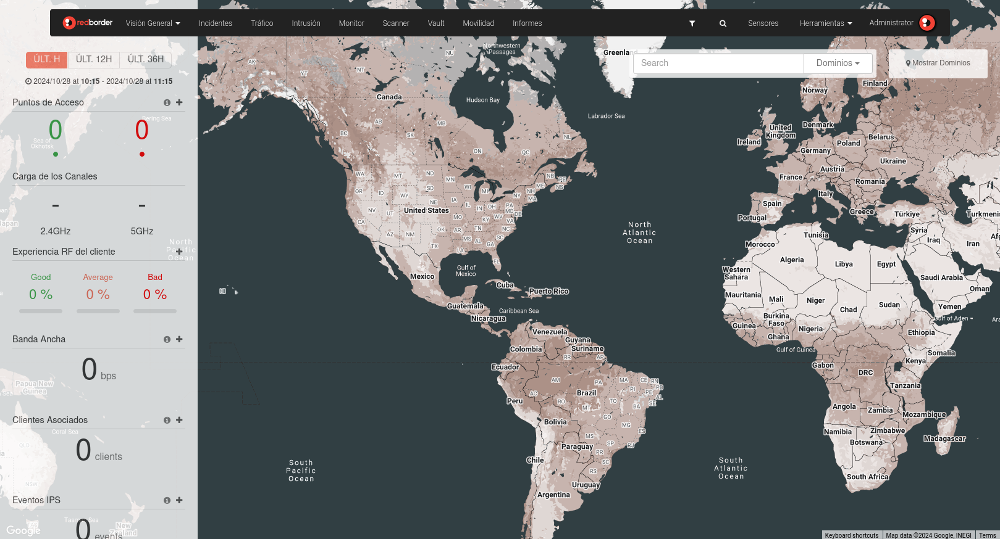

# Descripción General de la Interfaz

Cómo navegar por las funciones principales en Redborder Manager.

!!!info "Nota"
    Las capturas de pantalla mostradas en esta documentación pueden no mostrar siempre los nombres de productos o actualizaciones de la interfaz de usuario más recientes.

Menú de Navegación:

??? note "Visión General y Dashboards"
    ## Visión General and Dashboards

    La sección de Visión General proporciona una vista general de los sensores añadidos a Redborder Manager, su ubicación en el mapa y los puntos de acceso.

    En la barra lateral izquierda, puedes ver algunas métricas relacionadas con el Tráfico y la Movilidad.

    La opción en el menú superior incluye un menú desplegable que da acceso a los Dashboards.

??? note "Incidentes"
    ## Incidentes

    La sección de Incidentes de Redborder NDR te ayuda a detectar, investigar y responder rápidamente a eventos de seguridad mostrando la información más esencial en un solo lugar.

    Con los Incidentes de Redborder NDR, puedes:

      - Ver una lista de incidentes priorizados según la gravedad.
      - Abrir cada Incidente para ver un resumen rápido.
      - Profundizar en la información detallada para comprender mejor las amenazas, lo que facilita la clasificación y respuesta rápida.

    Para ver los incidentes enriquecidos promovidos a Redborder NDR, haz clic en Incidentes en el menú superior.

??? note "Tráfico"
    ## Tráfico

    La App de Tráfico está diseñada para visualizar datos de red en tiempo real. Permite filtrar por varias dimensiones, como direcciones IP, puertos, códigos de país y más, proporcionando información esencial sobre la actividad de la red.

    En esta sección, puedes ver los datos exportados desde una sonda Redborder Flowgate o directamente desde el tráfico de red exportado por un switch o router.

    Los formatos de exportación compatibles incluyen NetFlow y sFlow.

??? note "Intrusión"
    ## Intrusión

    La App Intrusion permite visualizar los datos generados por las sondas de tipo **Intrusion Probe**. Esta sonda analiza cada paquete que pasa por la red, comparándolo con patrones de detección de incidentes de ciberseguridad.

    En esta sección, puedes ver, filtrar e investigar qué eventos y problemas de seguridad han surgido en la red.

??? note "Monitor"
    ## Monitor

    La App Monitor permite la visualización de información generada por dispositivos de hardware. Utiliza "monitores" que se pueden asignar a los distintos sensores añadidos a la plataforma.

    Para monitorear estos dispositivos, la plataforma utiliza consultas SNMP.

??? note "Scanner"
    ## Scanner

    Redborder Scanner es una de las últimas incorporaciones a las Apps de la plataforma Redborder NDR.

    Esta App puede detectar vulnerabilidades dentro de los dispositivos de una red.

    Además, permite programar escáneres periódicos. Esta App utiliza la lista de vulnerabilidades conocidas del [NIST](https://nvd.nist.gov/vuln/search).

??? note "Vault"
    ## Vault

    La App Vault permite la visualización y búsqueda de logs. Redborder Manager NDR permite añadir sensores de tipo Vault que representan dispositivos con capacidad de envío de logs, estos los son envíados al Redborder Manager para su procesamiento.

    Los eventos de logs son normalizados y enriquecidos dentro de Redborder Manager.

??? note "Mobility"
    ## Mobility

    La App Movilidad permite la visualización de datos generados por el movimiento de dispositivos (visitantes) dentro de una red WiFi.

    Esta sección proporciona información sobre las áreas dentro de una instalación por las que se han movido los visitantes y en qué momentos.

??? note "Informes"
    ## Informes

    Esta sección proporciona herramientas para generar informes detallados y análisis de la actividad de red, eventos de seguridad y rendimiento de dispositivos dentro de la plataforma Redborder.

    Aquí, puedes crear informes personalizados sobre varias métricas, como patrones de tráfico, intentos de intrusión y movimientos de dispositivos.

    Los informes pueden programarse para su generación y entrega automática, proporcionando información periódica para ayudar a monitorear la salud y seguridad de la red.

??? note "Filtro Global"
    ## Filtro Global

    Permite aplicar un filtro general que afectará a los distintos dashboards, widgets y Apps de Redborder.

??? note "Búsqueda Rápida"
    ## Búsqueda Rápida

    Permite buscar entre las distintas Apps de Redborder, eventos y sensores.

??? note "Sensores"
    ## Sensores

    Esta sección visualiza y administra los sensores dentro de Redborder Manager.

    Los sensores son unidades básicas que representan fuentes de información. Hay varios tipos de sensores (Tráfico, Intrusion Probe, Flowgate, Vault, Monitors, etc.). Estos sensores pueden organizarse de forma jerárquica para permitir una vista ordenada por dominios.

??? note "Herramientas"
    ## Herramientas

    Este menú proporciona acceso a varias utilidades, como Alarmas, Auditorías y Playbooks, además de incluir opciones de administración dentro de Redborder Manager.

??? note "Perfil de Usuario"
    ## Perfil de Usuario

    Haz clic en tu nombre de usuario para abrir las siguientes opciones:

    - **Notificaciones**: Ver alertas y actualizaciones recientes relacionadas con tu cuenta y la actividad del sistema.
    - **Mi Perfil**: Acceder y editar la configuración y preferencias de tu cuenta personal.
    - **Mostrar Ayuda**: Abrir la sección de ayuda para obtener orientación sobre cómo usar las funciones de Redborder Manager.
    - **Desconectar**: Cerrar tu cuenta de forma segura.
