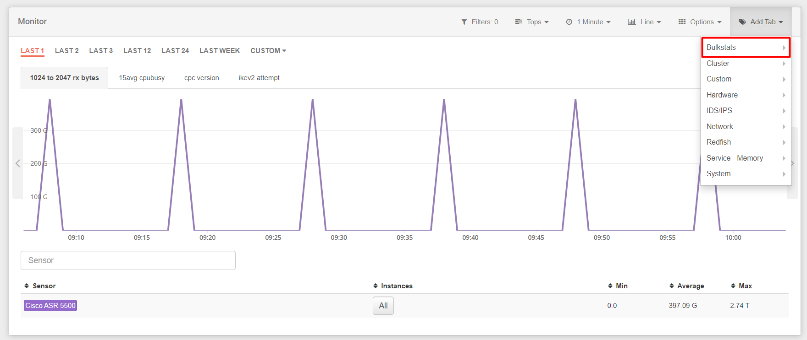
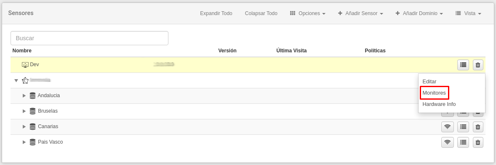
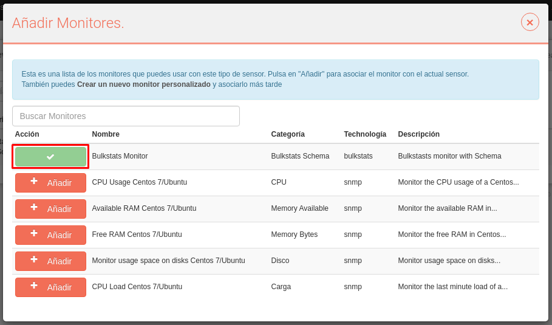

# Categorías de monitores

Aquí podemos agregar una nueva categoría para monitorizar el hardware. Las categorías utilizan tecnologías como *SNMP*, *Redfish*, *IPMI* o también un esquema *Bulkstats* para proporcionar información sobre el sistema y su funcionamiento.

Para agregar una nueva categoría de monitor debemos usar el botón superior derecho. Luego rellenaremos los campos seleccionando la tecnología correcta que permita a Redborder recibir los datos.

## Operaciones SNMP

Para explicar la operación de la función *SNMP* usaremos un ejemplo, monitorear el uso de memoria. Cuando creamos una nueva categoría de monitor con el botón **Nueva categoría de monitor** de la página **Categorías de monitor**, veremos la siguiente ventana emergente.

Esta es la fórmula para calcular el uso de memoria de un dispositivo:

    100*(memory_total-memory_free-memory_total_buffer-memory_total_cache)/memory_total

El resultado es una combinación de diferentes valores *SNMP*. Ahora, si queremos crear un monitor como el de este ejemplo, debemos elegir *Operación SNMP* en el menú desplegable de tecnología.

Debajo del campo *OID*, ahora hay un botón llamado Añadir nueva variable, que agrega otro campo para que podamos ingresar más *OID* snmp. Las *OID*'s que se usaron son:

    UCD-SNMP-MIB::memTotalReal.0
    UCD-SNMP-MIB::memAvalReal.0
    UCD-SNMP-MIB::memBuffer.0
    UCD-SNMP-MIB::memCached.0

En la parte inferior, hay un campo Operación de *OID*, en el que presentaremos la operación que queremos hacer con los *OIDs* ingresados previamente.

Para cada *OID*, la salida se almacenará en una variable que luego usaremos en la operación de *OID*.

Llegados a este punto, solo tenemos que crear el monitor presionando el botón *Crear*.

Para agregar el nuevo monitor a un dispositivo sensor, crearemos un nuevo sensor en la pestaña Sensor, seleccionando *Monitor Device*.

### Bulkstats

Las *Bulk Statistics* (o estadísticas recopiladas) son estadísticas que se recopilan en un grupo o esquema, por ejemplo, estadísticas del sistema, estadísticas de puertos o estadísticas *Radius*.

Es posible visualizar información de *Bulkstats* en el manager de Redborder, para ello es necesario configurar la parte del cliente en el dispositivo de Cisco para activar el envío de información al manager via *FTP*.

Una vez hecho esto, podremos visualizar toda la información referente a *Bulkstats* en el manager de Redborder accediendo a su pestaña correspondiente y seleccionando los campos deseados dentro del módulo de Monitor.

Para definir un monitor *Bulkstats* personalizado, primero es necesario que el usuario tenga un esquema de *Bulkstat* en su dispositivo de red que pueda guardar en un archivo de texto plano y darle un nombre (por ejemplo: *Bulkstats-Schema.txt*).

Normalmente, los esquemas de *bulkstats* se ven así:

Luego, se debe hacer clic en el botón **Nueva categoría de monitor** y dentro del nuevo formulario de categoría de monitores, seleccione *Bulkstats* en la lista de **Tecnología**. Esto mostrará la nueva opción para colocar su archivo de esquema de archivos masivos que define la configuración del usuario.

Para asignar la nueva categoría de monitor a un *device sensor*, es necesario crear un *monitor device* (si el usuario aún no ha creado uno) desde la vista de *Árbol de sensores*.

Hacer clic en el menú del sensor y luego haga clic en *Monitores*.

Dentro del menú de monitores, presionamos el botón **Añadir Monitor** y dentro de la ventana, presionamos el botón **Añadir** correspondiente a la categoría de monitor creada.

Una vez agregado el monitor al sensor, mostraría el destino donde necesita configurar el dispositivo para enviar la información.

La *URL* corresponde a la ruta de destino. Es necesario configurar el protocolo *SFTP* en la red del dispositivo para enviar la información sobre los esquemas *bulkstats* al manager.