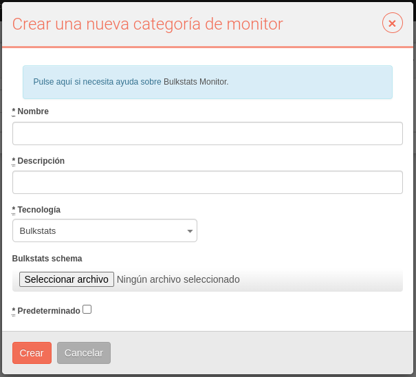

# Monitor Categories

Here we can add a new category to monitor hardware. The categories use technologies like *SNMP*, *Redfish*, *IPMI*, or a *Bulkstats* scheme to provide information about the system and its operation.

To add a new monitor category, we need to use the button in the upper right corner. Then we will fill in the fields by selecting the correct technology that allows Redborder to receive the data.

## SNMP Operations

To explain the operation of the *SNMP* function, we will use an example, monitoring memory usage. When we create a new monitor category with the **New monitor category** button on the **Monitor Categories** page, we will see the following popup window.

This is the formula to calculate the memory usage of a device:

    100*(memory_total-memory_free-memory_total_buffer-memory_total_cache)/memory_total

The result is a combination of different *SNMP* values. Now, if we want to create a monitor like this example, we must choose *SNMP Operation* in the technology dropdown menu.

Below the *OID* field, there is now a button called Add new variable, which adds another field so we can enter more *SNMP* OIDs. The OIDs used are:

    UCD-SNMP-MIB::memTotalReal.0
    UCD-SNMP-MIB::memAvailReal.0
    UCD-SNMP-MIB::memBuffer.0
    UCD-SNMP-MIB::memCached.0

At the bottom, there is an *OID* Operation field, where we will enter the operation we want to perform with the previously entered *OIDs*.

For each *OID*, the output will be stored in a variable that we will then use in the OID operation.

At this point, we just have to create the monitor by pressing the *Create* button.

To add the new monitor to a sensor device, we will create a new sensor on the Sensor tab, selecting *Monitor Device*.

### Bulkstats

*Bulkstats* (Bulk Statistics) are statistics that are collected in a group or scheme, such as system statistics, port statistics, or *Radius* statistics.

It is possible to view *Bulkstats* information in the Redborder manager; for this, it is necessary to configure the client part on the Cisco device to activate the information sending to the manager via *FTP*.

Once this is done, we will be able to view all the *Bulkstats* information in the Redborder manager by accessing its corresponding tab and selecting the desired fields within the Monitor module.

To define a custom *Bulkstats* monitor, it is first necessary for the user to have a *Bulkstat* schema on their network device that can be saved in a plain text file and named (e.g., *Bulkstats-Schema.txt*).

Normally, *bulkstats* schemas look like this:

Then, click on the **New monitor category** button and within the new monitor category form, select *Bulkstats* from the **Technology** list. This will show the new option to place your bulk file schema file that defines the user's configuration.

To assign the new monitor category to a *device sensor*, it is necessary to create a *monitor device* (if the user has not already created one) from the *Sensor Tree* view.

Click on the sensor menu and then click on *Monitors*.

Within the monitor menu, press the **Add Monitor** button and within the window, press the **Add** button corresponding to the created monitor category.

Once the monitor is added to the sensor, it will show the destination where you need to configure the device to send the information.

The *URL* corresponds to the destination path. It is necessary to configure the *SFTP* protocol on the device's network to send information about the *bulkstats* schemas to the manager.