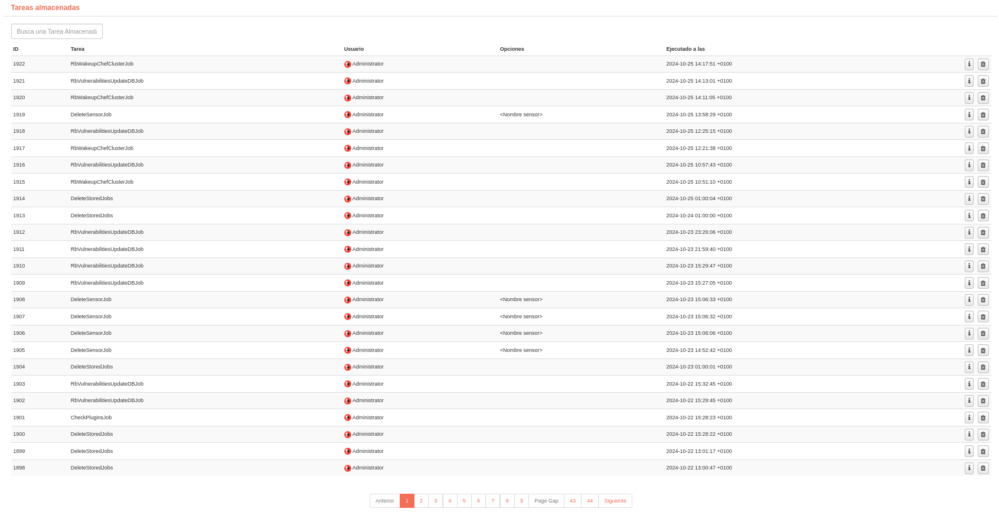
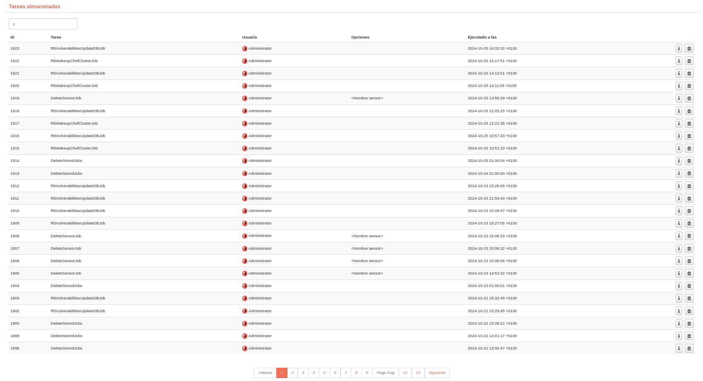

# Trabajador y cola de tareas

En esta opción, el usuario puede verificar el estado del trabajo (*Trabajador*) y las tareas (*Jobs*) que se ejecutan en segundo plano. También puede verificar cuáles de estas tareas se han completado.

Llamamos **Trabajador** a los programas que se ejecutan constantemente en segundo plano y **Tarea** a un programa que se ejecuta periódicamente o solo una vez, pero no permanece ejecutándose en segundo plano, sino que se ejecuta y se cierra.

Las tareas pueden ser lanzadas manualmente a través del menú **Opciones de Trabajador**, pero en determinados casos se necesita detener antes la tarea para posteriormente lanzarla manualmente.

**Delete Stored Job** todos los días a las 00:00h elimina las tareas almacenadas desde una fecha determinada que depende del campo "Dias de tareas guardadas almacenadas" y puede modificarse en la **Configuración general**.

**Tareas almacenadas** muestra la lista de servicios terminados. Puede conocer el estado de cada uno a través del icono "Información", o eliminar de la lista utilizando el icono "Eliminar". También se puede buscar por el **nombre de la tarea**.

**Información** permite comprobar el estado e información de los servicios terminados.

**Eliminación** elimina una tarea de la lista de servicios terminados.

**Búsqueda** permite buscar por el nombre de la tarea y se actualiza automáticamente la lista de resultados cada vez que se modifica el campo de búsqueda.

