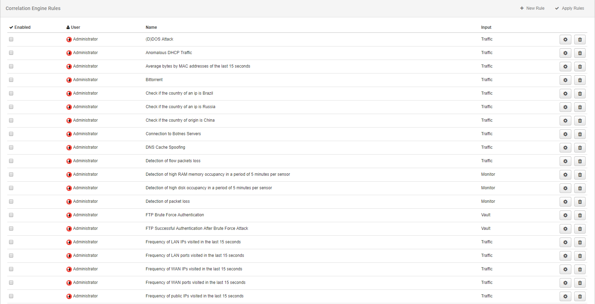
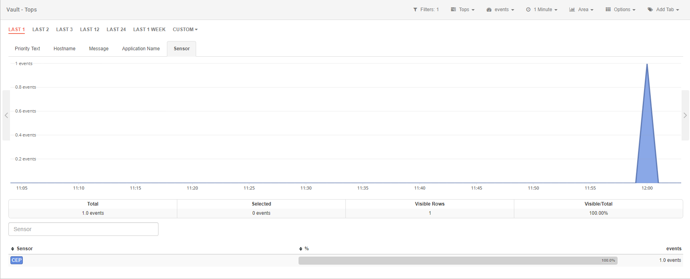

# Alerta de ataque de autenticación de fuerza bruta

Podemos utilizar Redborder para alertar sobre posibles ataques de fuerza bruta gracias al uso de su motor de correlación y las reglas establecidas. Primero, debemos ir a la sección **Reglas del motor de correlación** ubicada **Herramientas**.

Reglas del CEP

Luego activaremos la regla que queremos usar. En este caso **Autenticación de fuerza bruta SSH**. Finalmente, debemos aplicar los cambios.

Reglas del CEP: detección de autenticación por fuerza bruta

Esta regla es capaz de generar una alerta cuando ocurren 200 intentos fallidos de inicio de sesión en una ventana de tiempo de 20 minutos en una máquina Linux a través del protocolo *SSH*. Para esto, es necesario tener el sensor de bóveda correspondiente creado previamente haciendo referencia a la IP de la máquina que queremos proteger. Una vez hecho esto, en caso de recibir un ataque de fuerza bruta, podríamos visualizar la alerta correspondiente accediendo al módulo **Vault**. Para poder verlo fácilmente, podemos agregar una pestaña de sensor y filtrar por CEP.

Módulo de Vault: alerta de ataque de fuerza bruta

También podemos mostrar el mensaje de alerta si cambiamos a la pestaña de mensajes.

Módulo de Vault: mensaje de alerta de ataque de fuerza bruta
