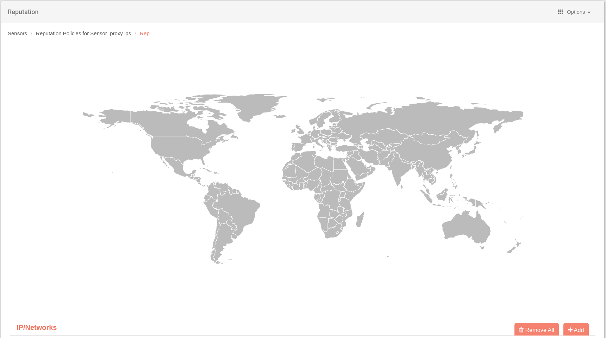
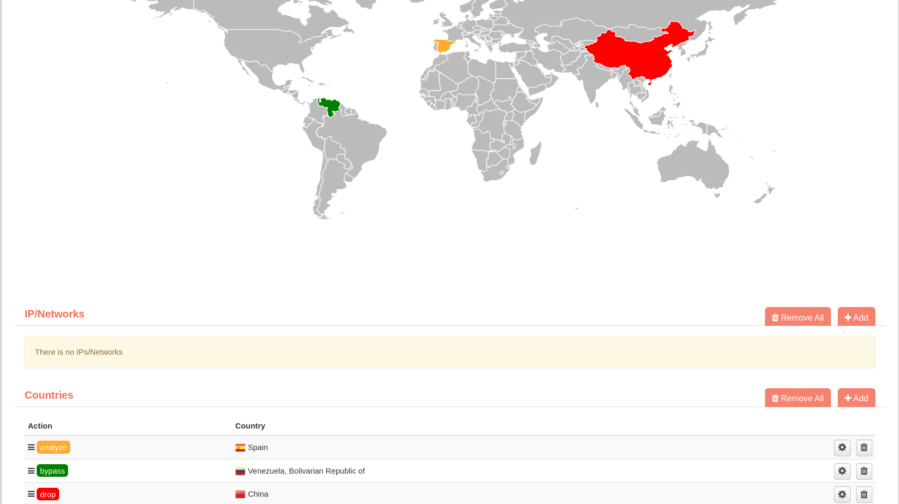
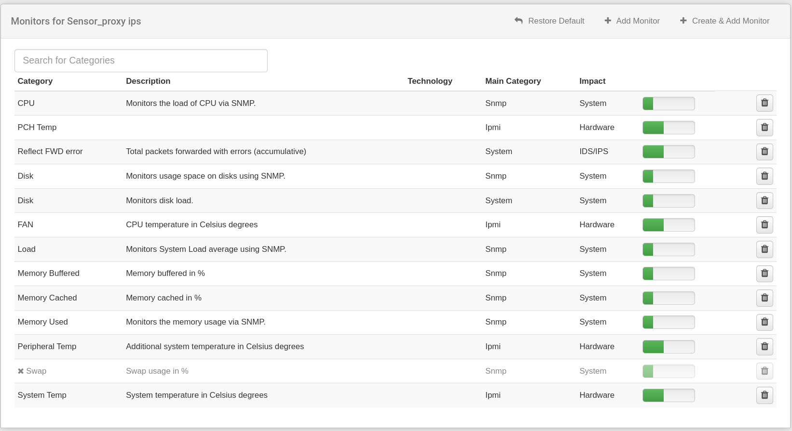

# Políticas

Cada sensor IPS necesita un conjunto de reglas para identificar amenazas potenciales... En este capítulo, establecerás las reglas que el IPS necesita para reconocer el tráfico como intrusión. Por defecto, no hay políticas definidas y se considera que el administrador las configure en función de condiciones determinantes como: volumen de tráfico, recursos y requisitos del hardware, políticas en la organización, etc.

Las reglas que se van a aplicar en el IPS se conocen como políticas. Hay dos políticas principales: **Políticas de firma** y **Políticas de reputación**. Las políticas de firma son ese tipo de reglas que pueden ser activadas por una coincidencia entre la regla y un paquete del tráfico. Por otro lado, las políticas de reputación identifican la dirección IP del paquete y se activan si está relacionada con una red o país específico.

Ambos tipos de políticas son complementarias, por lo que puedes explotar una sola de las características o ambas al mismo tiempo. En los próximos pasos, verás cómo configurar las políticas.

!!! advertencia "Sobre la configuración"
    Este capítulo supone que ya tienes un IPS reclamado y funcionando como sensor.

    
    Sensor IPS reclamado y funcionando

    Por favor, localiza tu IPS en la pestaña **Sensores**.

## Propiedades del sensor

Al hacer clic en el ícono de *cuatro líneas*, puedes expandir las propiedades del IPS.

Menú de propiedades del IPS

## Edición del IPS

Cada uno de los siguientes campos se puede expandir para configurar.

!!! advertencia "Si cambias alguna propiedad..."
    Recuerda presionar el botón **Actualizar** en la parte inferior 

### Exportador

El IPS permite la exportación de tráfico que cualquier interfaz del IPS puede capturar. En este menú puedes establecer la dirección IP **Dirección de destino** de un sensor de flujo y el puerto basado en el protocolo:

Exportador

Para hacerlo, presiona el ícono de *cuatro líneas* y edita las propiedades de la conexión:

Detalles del exportador

!!! info "Relación entre puertos y protocolos de exportación de tráfico..."
    Normalmente, vas a usar el puerto 2055 para cualquier versión de netflow y el puerto 6343 para sflow.

!!! advertencia "Si estás configurando un exportador..."
    Es obligatorio configurar un sensor de flujo que va a recibir el flujo de tráfico.

#### Dirección de destino

Esta es la dirección del administrador que va a recibir el tráfico; y el puerto basado en el protocolo de exportación. Este campo es obligatorio si realmente deseas exportar el tráfico.

#### ID de observación

La observación es solo un nuevo campo incluido para tener una forma adicional de filtrar el contenido en la vista de tráfico, dividiendo la información capturada de diferentes subredes. Puedes establecer un número único positivo o dejarlo vacío si no deseas filtrar por ello.

## Grupos

En caso de que el IPS tenga algún segmento configurado, aquí puedes gestionar los recursos de procesamiento asignados a cada segmento.

Grupos

## Políticas de firma

Por defecto, no se crea ninguna política de firma para los ips. Eso es lo que puedes observar en el **menú de políticas de firma**. De hecho, no se obtiene ninguna **Regla** en **Versiones de Regla** y es obligatorio tener al menos una para crear una política de firma.

Políticas de Firma

Para agregar la primera política, presiona **Nueva Política**, aparecerá una ventana para crear una:

Detalle de Política de Firma

!!! advertencia "Si no puedes ver ninguna **Fuente de Regla**..."
    No se está descargando ninguna **Regla** por defecto. Es obligatorio tener al menos una para definir una política de firma. Para hacerlo, ve a **Herramientas > Configuración General > Versiones de Regla**.

### Versiones de Regla

Acceso a la versión de regla

### Volver a la política de firma

Aquí debes seleccionar un nombre y una de las fuentes de reglas. Después de eso, confirma haciendo clic en **Crear Política de Firma**. Todas las reglas en esa política aparecerán:

Selección de Reglas

Los detalles de las reglas se pueden ver expandiendo cada categoría:

Reglas expandidas

Por defecto, todas las reglas están siendo ignoradas. Puedes cambiar la acción a realizar cuando un paquete activa una acción a **pasar, alertar, descartar o limpiar**. Podemos seleccionar un conjunto de reglas y/o categorías para aplicar al mismo tiempo la misma acción marcando las casillas a la derecha y expandiendo el menú **Cambiar Acciones**.

Después de la configuración de la política, regrese al **menú de políticas de firmas**. Aquí verá la nueva política creada:

Políticas de Firma

Para finalmente aplicar la configuración, haga clic en el botón **Asignar**.

## Políticas de Reputación

Por defecto, al igual que ocurrió con las políticas de firma, no se crea ninguna política para las IP. Para agregar la primera política, presione **Nueva Política de Reputación**, aparecerá una ventana para crear una. Aquí debe seleccionar un nombre y una de las fuentes de reglas. Después de eso, confirme haciendo clic en **Crear Política de Firma**. Aparecerá un mapa político:

Mapa de Reputación

Puede configurar la dirección mediante un conjunto de redes o considerando países enteros. Haga clic en **+Agregar** en la categoría correspondiente para agregar una red o una ubicación.

País

Aquí puede seleccionar la acción a tener en cuenta para cada regla definida: **analizar, omitir o eliminar**.

En caso de que una región tenga una regla, esa parte del mapa se coloreará, dependiendo de la acción seleccionada:

Mapa de Color

Después de la configuración de la política, regrese al **menú de políticas de reputación**. Aquí verá la nueva política creada:

Políticas de Reputación

Para finalmente aplicar la configuración, haga clic en el botón **Asignar**.

## Aplicar Configuración

Después de cualquier cambio en las políticas anteriores, la configuración se puede aplicar aquí seleccionando las casillas de verificación correspondientes y pulsando **Update**.

  
Actualización de configuración

## Monitores

En los monitores puedes verificar los recursos consumidos por cada parte de este sensor. Aquí puedes comprobar si alguna categoría está teniendo un alto impacto sobre las demás.

  
Monitor IPS

# ¿Qué es lo sigueinte?  
Ve a la pestaña **Intrusión** y verifica si alguna alerta ha sido activada por algún sensor IPS.
