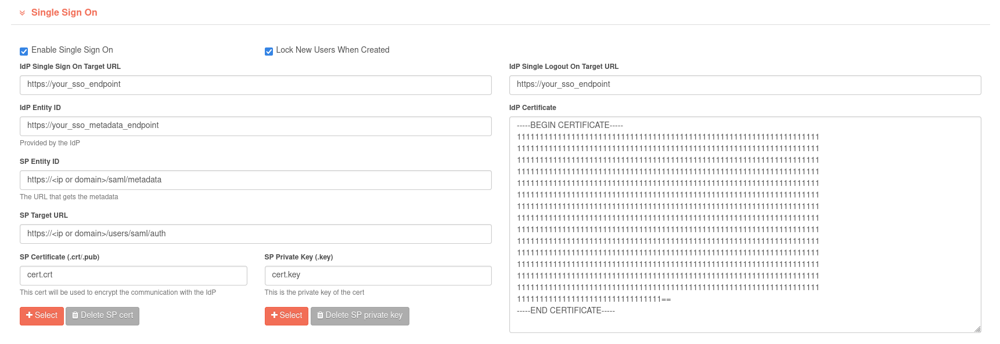

# Integrar Single Sign On con la Plataforma Web de Redborder  

Esta documentación proporciona una guía paso a paso para integrar [Single Sign On](https://en.wikipedia.org/wiki/Single_sign-on) (SSO) utilizando el [protocolo SAML](https://en.wikipedia.org/wiki/SAML_2.0) con la Plataforma Web de Redborder. Siguiendo estas instrucciones, podrás habilitar SSO y configurarlo, permitiéndote iniciar sesión y registrarte en la Plataforma Web de Redborder.  

Diagrama del Protocolo SAML:  

```mermaid
sequenceDiagram
    autonumber
    actor Usuario
    Usuario->>SP: Haz clic en el botón "Iniciar sesión vía SSO"
    SP-->>Usuario: Iniciar proceso de inicio de sesión
    Usuario->>+IdP: Iniciar el servicio de inicio de sesión del IdP
    note over IdP: Identificar/Autenticar al usuario
    IdP-->>-Usuario: IdP genera SAML encriptado
    Usuario->>SP: Enviar la respuesta SAML
    SP-->>Usuario: Si la respuesta SAML contiene el campo autenticado correctamente, SP responde con la información solicitada
```  

## Habilitar SSO  

Primero, se necesita habilitar el sistema de inicio de sesión SSO. Para eso, ve a `Configuración General -> Single Sign On` y active el *checkbox* relacionado.  

Después, el sistema de inicio de sesión SSO estará habilitado. Puedes comprobarlo yendo a la ruta de inicio de sesión y viendo que hay un botón "Login via SSO" como en la imagen de debajo.  

  

## Configurar la interfaz web de Redborder para usar SSO  

1. Ve a `Configuración General`.  
2. Haz clic en la tarjeta **"Single Sign On"**.  
3. Rellena los campos con los valores correspondientes.  
4. Presiona el botón **"Actualizar"** para aplicar los cambios.  

### Parámetros configurables  

  

- **Bloquear Nuevos Ususarios Recién Creados**: Este ajuste activa la opción de bloquear la cuenta al crearse.  

=== "Parámetros del IdP"  
    - **URL de destino del IdP SSO**: Esta es la URL que redirige al IdP cuando deseas iniciar sesión.  
    - **URL de destino del IdP SLO**: Esta es la URL que redirige al IdP cuando deseas cerrar sesión. Hay algunos IdPs que no tienen esta configuración, entonces escribe la ruta de cierre de sesión de Redborder: `<host>/users/logout`.  
    - **ID de Entidad del IdP**: Esta es la URL usada por el SP para verificar las respuestas SAML recibidas por el IdP.  
    - **Certificado del IdP**: El certificado único proporcionado por el IdP que permite descifrar la respuesta encriptada de la autenticación y obtener los atributos del usuario.  

=== "Parámetros del SP"  
    - **ID de Entidad del SP**: Esta es la URL del SP que recibirá los metadatos del IdP.  
    - **URL de destino del SP**: Esta es la URL del SP que comprueba la respuesta SAML y permite el inicio de sesión.  
    - - **SP Certifcate**: Este es el archivo que contiene la clave pública que encriptará la comunicación con el IdP. Debe ser un archivo con extensión `.pub` o `.crt`.  
    - **SP Private Key**: Este es el archivo que contiene la clave privada que encriptará la comunicación con el IdP. Debe ser un archivo con extensión `.key`.  

## Registro e inicio de sesión  

Después de configurar todos los ajustes, se puede iniciar sesión mediante SSO. Para usarlo, vaya a la ruta de inicio de sesión y se verá un botón que se refiere a SSO. Tras hacerse click en él, la página se redirigirá al servicio SSO configurado del IdP. Para ayudar con la configuración de metadatos necesarios se dispone de un botón de descarga que genera el archivo XML de metadatos que debe colocarse en el IdP.

!!! info "Ten en cuenta..."
        Este botón de descarga solo está habilitado si está activo el servicio SSO.
        Puede tardar unos minutos en permitir la descarga si se acaba de activar, debido a la espera de la puesta en marcha del servicio y la generaración del fichero.

Servicio SSO desactivado.

Servicio SSO activado.