# Instalación en Linux

Cómo instalar Redborder Manager en sistemas Linux.

Cosas importantes que debes saber antes de la instalación:

1. Esta instalación es irreversible; no se puede desinstalar directamente ni revertir.
2. La distribución de Linux compatible en este momento es [Rocky Linux 9 minimal](https://rockylinux.org/download).

## Requisitos previos

### Máquina virtual o baremetal

Los requisitos mínimos pueden variar según el modo del nodo. Estos son los requisitos para un nodo full:

| **Componente**      | **Especificación**                                     |
|--------------------|-------------------------------------------------------|
| **Sistema Operativo** | Rocky Linux 9 minimal                               |
| **Memoria**         | 16 GB RAM                                             |
| **Almacenamiento**        | 80 GB de espacio en HDD                                       |
| **CPU**            | al menos 4 núcleos de CPU o 4 vCPU                       |
| **Interfaces de Red**  | al menos 1 para nodo único o 2 para crear un clúster de múltiples nodos     |

## Instalación de Paquetes

Instala el sistema operativo compatible y ejecuta el siguiente comando como root:

``` bash title="Instalación de repositorios"
yum install epel-release
rpm -ivh https://repo.redborder.com/ng/24.11/rhel/9/x86_64/redborder-repo-24.11-0.0.1-1.el9.rb.noarch.rpm
```
``` bash title="Instalar el paquete redborder-manager"
yum clean all
yum install redborder-manager -y
```

Inicia una nueva sesión de bash para recargar las variables de entorno:

``` bash title="Recarga de Bash"
/bin/bash --login
```

## Asistente de configuración

Inicia el **asistente de instalación**:

``` bash title="Comando para el asistente de instalación"
rbcli setup wizard
```

La primera pantalla también guía con los siguientes pasos.

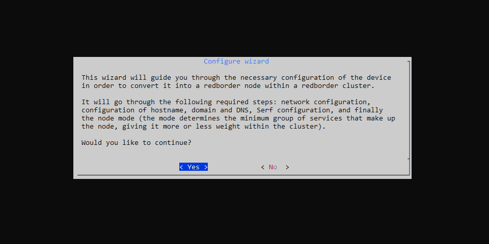

Presiona **Yes** para continuar.

### Configuración de Red (opcional)

Presiona **Yes** para configurar manualmente los ajustes de red o presiona **No** para mantener la configuración actual del sistema.

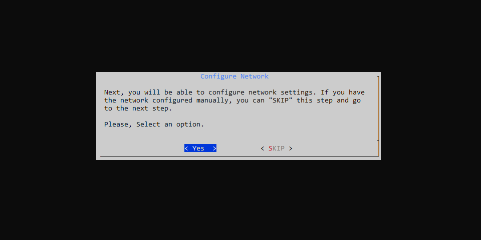

Selecciona la interfaz de red que deseas configurar manualmente.


Una vez que se completen todas las configuraciones de la interfaz de red, selecciona **Finalize** para continuar con los siguientes pasos.

#### Modo de Dispositivo de Red

Al seleccionar una interfaz y entrar en su configuración, se nos da la opción de configurarla con una dirección IP estática o de hacer que funcione de manera dinámica (con DHCP).

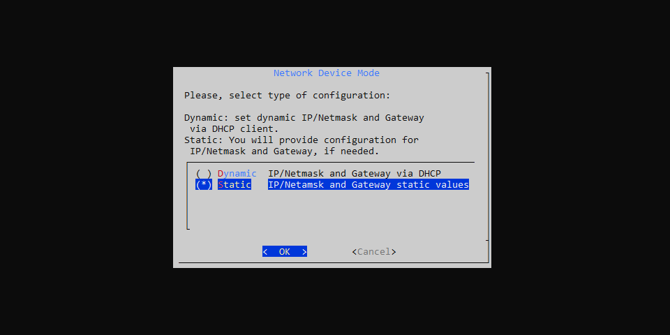

#### Configuración de Red para una Interfaz de Red

Ingresa la dirección IP, la máscara de red (Netmask) y la puerta de enlace (Gateway). Deja la puerta de enlace en blanco si no es necesaria, por ejemplo, para la interfaz de red de sincronización.

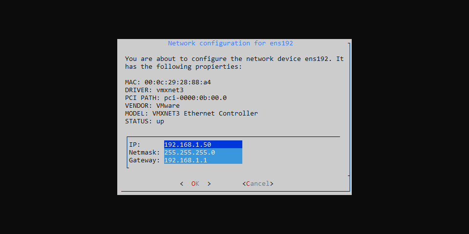

Repite el proceso para configurar la interfaz de red de sincronización (Sync).

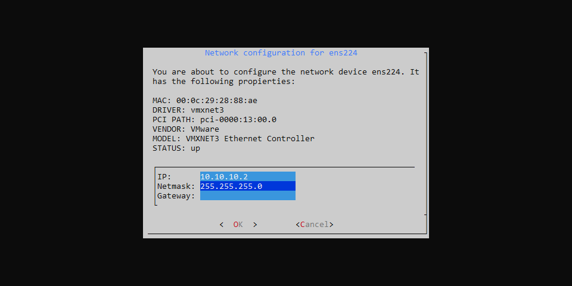

### Seleccionando la interfaz de gestión

La interfaz de gestión es la que usarás para acceder a Redborder Manager.

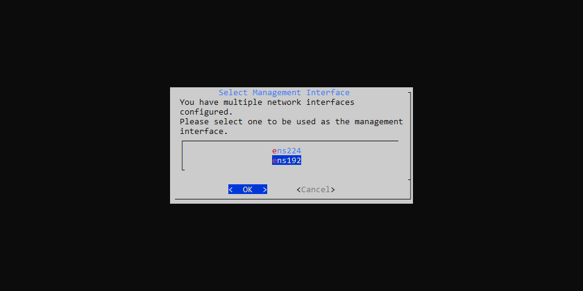

### Configuración de DNS (opcional)

Presiona **Yes** si deseas configurar el DNS.


Puedes ingresar hasta tres direcciones DNS diferentes.

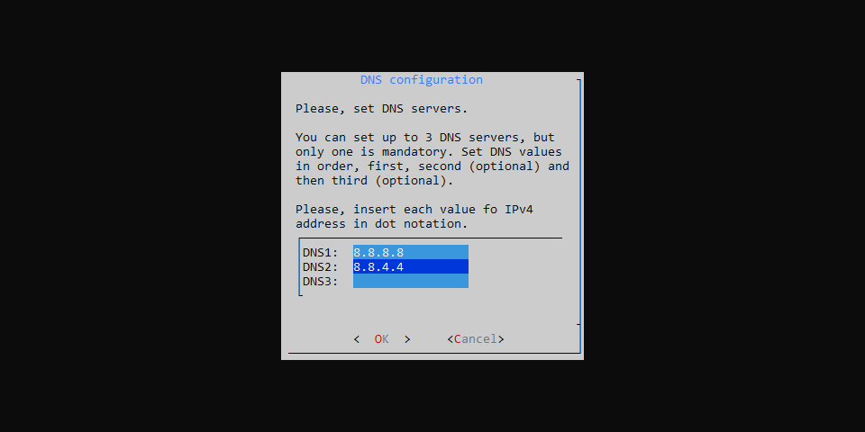

Presiona **OK**  para continuar.

### Configuración del nombre de host y del nombre de dominio

Modifica los siguientes valores si deseas personalizar el nombre de host y el nombre de dominio del nodo, o simplemente presiona **OK**  para mantener los actuales.


### Configurar el Servicio de Clúster (Serf)

Redborder Manager tiene la capacidad de trabajar de manera distribuida. Serf es una solución descentralizada para el descubrimiento de servicios y la orquestación, que es ligera, altamente disponible y tolerante a fallos. Presiona **OK** para comenzar la configuración de Serf.

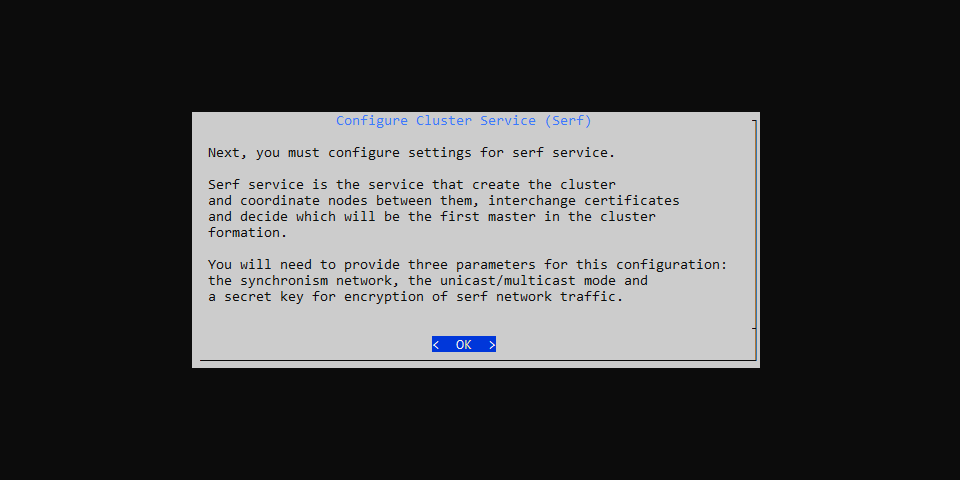

#### Configuración de la Red de Sincronización

La red de sincronización es la red utilizada para que todos los administradores se sincronicen entre sí. Si estás configurando un clúster, asegúrate de seleccionar una interfaz distinta de la de gestión.

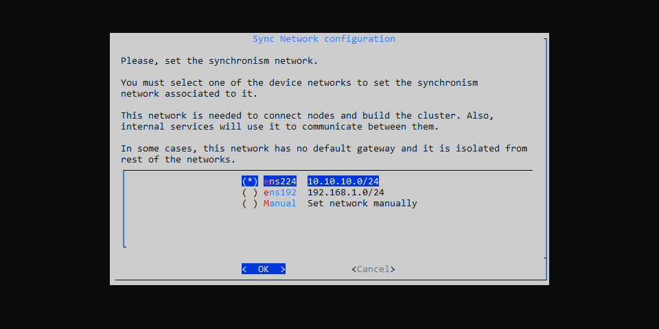

#### Modo de Clúster de Comunicación

Selecciona Unicast o Multicast para las comunicaciones de Serf.

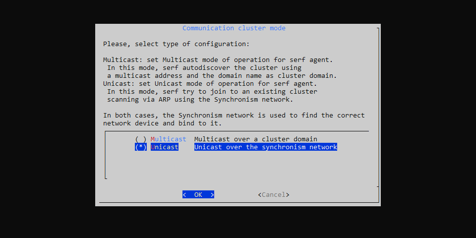

#### Clave de encriptación secreta

Proporciona una contraseña para Serf. Recuerda guardar esta contraseña de forma segura, ya que la necesitarás para agregar más nodos al clúster.

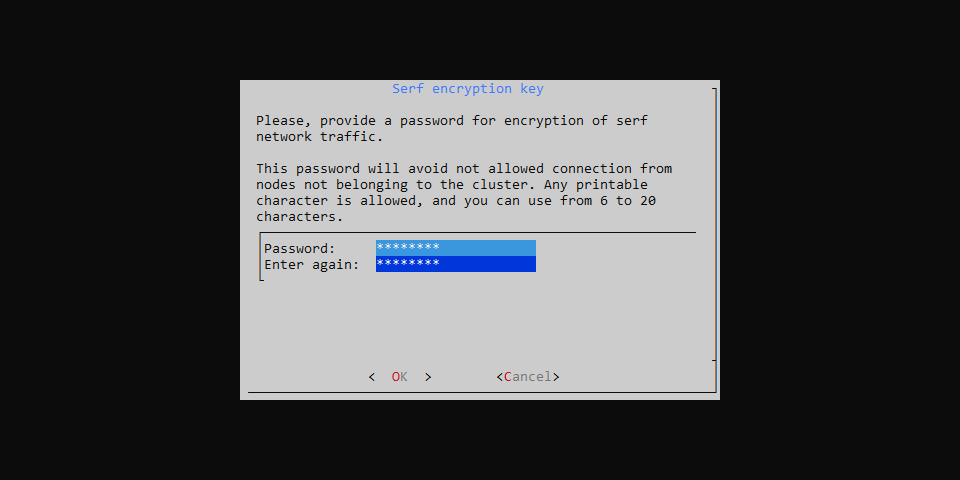

### Almacenamiento con Amazon S3 (opcional)

Es posible utilizar el servicio de almacenamiento remoto de Amazon con S3.

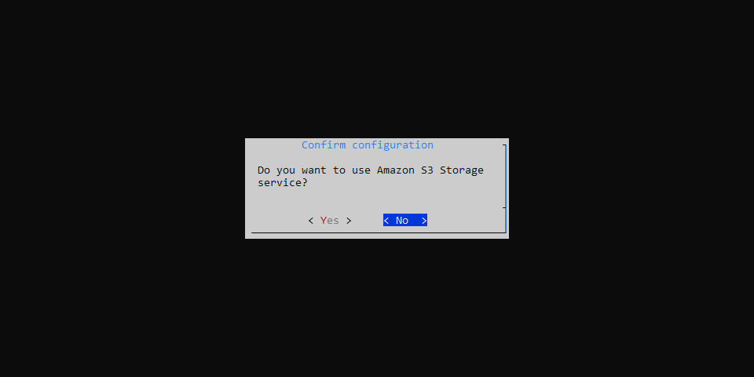

### Base de Datos Externa (opcional)

También es posible configurar Redborder para utilizar el servicio Amazon RDS u otra base de datos PostgreSQL.

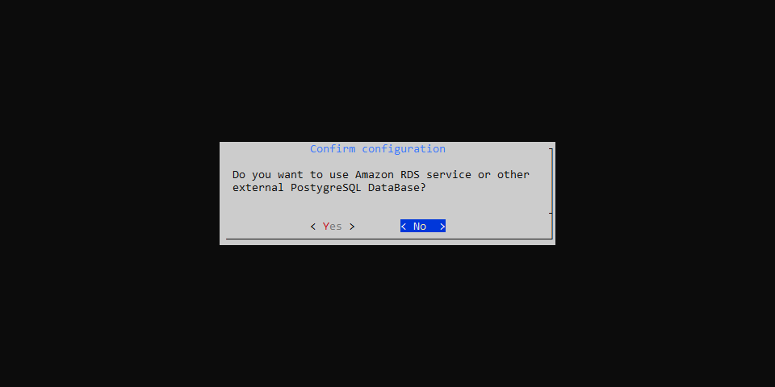

### Configurar el modo de administrador

Aquí puedes seleccionar el modo para el nodo que estás instalando. Estos modos afectan cómo se configurarán los nodos a nivel de servicio. Si estás instalando un solo nodo o el primer nodo (líder), selecciona el modo full (por defecto) y presiona **OK** para continuar.

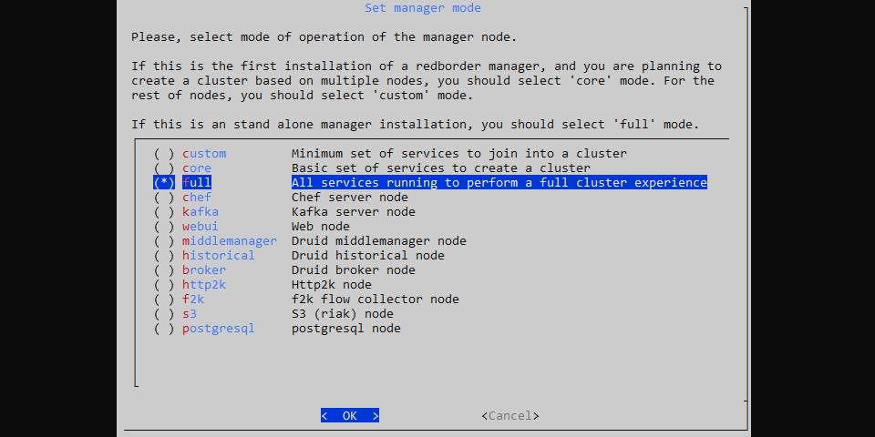

### Aplicando configuración

Confirma la configuración del asistente presionando **Yes**.

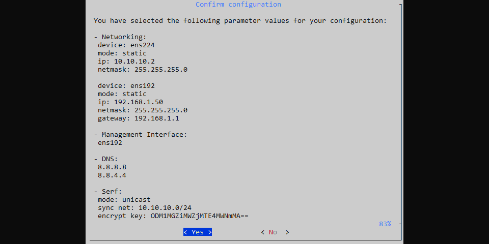

El sistema ahora aplicará la configuración. Presiona **Ok** para salir del asistente.

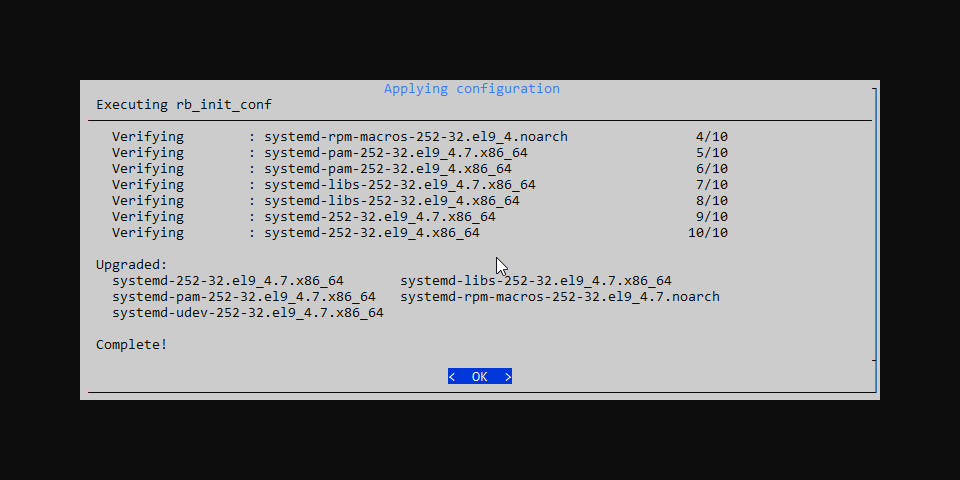

¡Felicidades! Has instalado exitosamente **Redborder Manager**.

Ahora el nodo se configurará; este proceso puede tardar varios minutos, dependiendo del modo y del hardware en el que esté instalado.

Una vez completado este proceso, podrás acceder al servicio **Redborder Webui** ingresando desde un navegador a `https://<manager-ip-de-gestión>`
