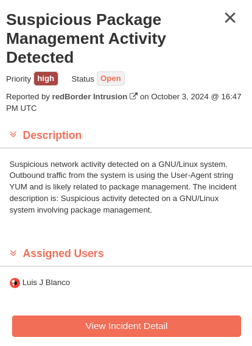
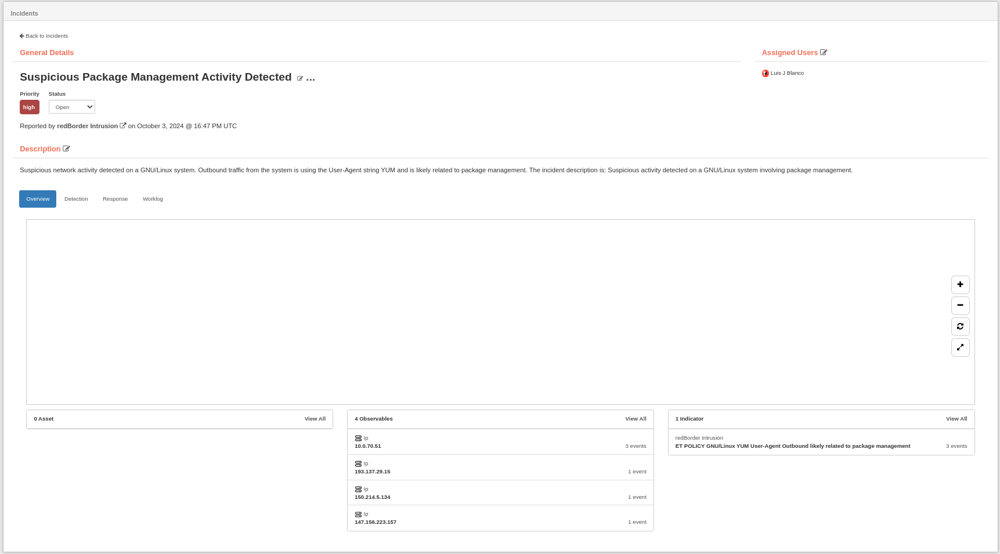

# Incidents

Incidents are the main element of the RedBorder platform. They are the result of the analysis of the events and alerts generated by the system waiting to be reviewed by the user, either to be reported or dismissed.

Incidents view

## Parts of the view

You can see the different parts of the view in the previous image:
* A search bar to find an incident.
* A filter bar to filter the incidents.
* The list of incidents.

By default, no filter is applied and the list is ordered by the date from most recent to oldest.

## Fields of an incident

The fields of an incident are the following:

* ID: Unique identifier of the incident.
* Priority: The priority of the incident to be managed.
* Name: An explanatory name of the incident.
* Source: The datasource from where the incident was generated from.
* Created at: The date and time when the incident was detected.
* Assigned: The user of the web that currently has the incident assigned.

## Actions on an incident

The actions that can be performed on an incident are the following:
* Click on the name of the incident to see the details of the incident.
* Click on the source of the incident to go to the view of the source of the incident.
* Click on status to change the status of the incident.
* Click on the settings icon to start managing the incident.
* Click on trash icon to delete the incident.

By clicking on the name of the incident will show the details of the incident, expanding the explanation of it. Clicking on **View Incident Detail** will have the same effect as clicing on the settings icon. In both cases, if incident's status was **New**, it will change to **Open**; and the user assigned to yourself.

Incident summary

## Getting into the incident

The main purpose of this view is to provide the user with all the information about the incident and the possibility to document the process of investigation (**detection**) and **response**.

Incident detail

### Overview
### Detection
### Response
### Worklog

