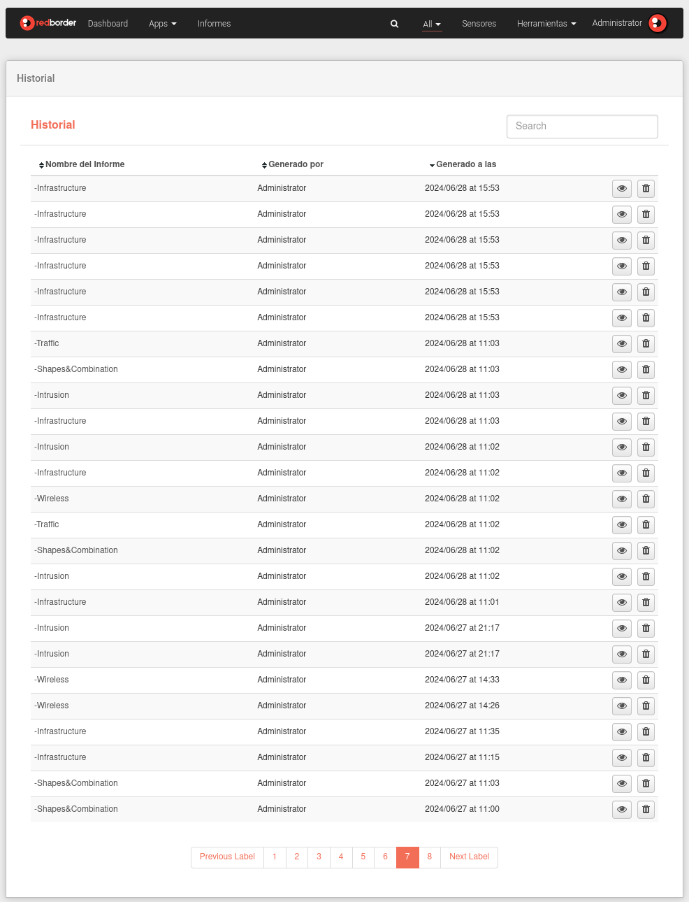
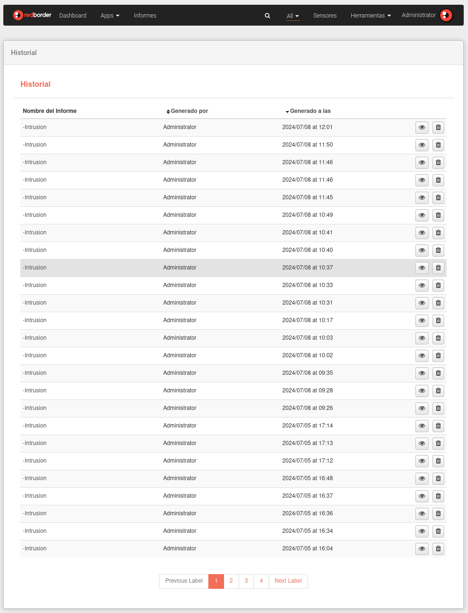

# Módulos

En la **Sección de Eventos** el usuario puede **mostrar, analizar y gestionar** los eventos recolectados por los sensores.

Redborder ofrece la máxima visibilidad de red gracias a las muchas opciones de representación y visualización de datos que nuestras Apps proveen.

La plataforma tiene un módulo para cada funcionalidad. Cada una utiliza diferentes tecnologías y tiene una interfaz independiente. Todos los módulos necesitan un sensor que le provea de datos.

## Business Intelligence

El módulo **Business Intelligence** utiliza la información de clientes a través de los sensores BI. Puede ser usado para obtener las respuestas de los cuestionarios definidos en la plataforma **[RBMobility](https://rbmobility.redborder.com)**.

Este módulo viene desactivado por defecto, para activarlo ejecute el siguiente comando desde la consola:

    rb_set_modules bi:1; chef_client

Módulo de BI

<!-- ## Malware (WIP)

El módulo **Malware** es una solución completa para la detección de archivos, direcciones IP y direcciones URL maliciosas. Para ello se emplean múltiples motores de detección y servicios de reputación que van más allá de las políticas basadas en firmas y técnicas similares.

Este módulo viene desactivado por defecto, para activarlo ejecute el siguiente comando desde la consola:

    rb_set_modules malware:1; rb_set_malware_mode enable logstash; chef_client

Módulo de Malware -->

## Tráfico

El módulo **Tráfico** utiliza netflow para extraer información sobre todo el tráfico del sensor. El módulo provee información como IPs, protocolos, localizaciones y mucho más.

Módulo de Tráfico

## Intrusion

El módulo **Intrusión** utiliza datos del sensor o sensores IPS para mostrar eventos de intrusión basados en reglas de Snort. También, gracias a las diferentes vistas que incluye RedBorder, es posible analizar los paquetes que coincidieron con la especificación de la regla.

Módulo de Intrusión

## Monitor

El módulo **Monitor** utiliza datos provenientes de protocolos SNMP, Redfish e Ipmi para mostrar el estado de la infraestructura.

Módulo de Monitor

## Vault

El módulo **Vault** utiliza datos de syslog para proveer información sobre eventos de diferentes orígenes, tales como categoría, objetivo, acción del evento y más.

También es posible aumentar las capacidades del módulo Vault a través de las extensiones que añaden compatibilidades con otros fabricantes.

Módulo de Vault

## Movilidad

El módulo **Movilidad** provee información de localización de sensores de APs de la red. Puede ser usado para mostrar como las personas se mueven en un edificio.

Módulo de Movilidad

## Wireless

El módulo **Wireless** proporciona un análisis de los datos de los visitantes de sensores APs de la red **sin tener en cuenta el cálculo de movimientos**.

Este módulo viene desactivado por defecto, para activarlo ejecute el siguiente comando desde la consola:

    rb_set_modules wireless:1; chef_client

Módulo de Wireless

## Informes

El módulo de **Informes** permite al usuario realizar informes periódicos con la información que ofrece la plataforma Redborder.

Para crear un nuevo informe, haga clic en el botón *Nuevo informe* y complete todos los campos requeridos. También tiene la opción de importar un informe desde un archivo utilizando el botón *Importar informe*. A la vez, a su lado tiene un botón para ver el historial completo de todos los informes a los que tiene acceso.

Para buscar informes, introduzca parte del nombre o de la descripción del informe en la barra de búsqueda y presione la tecla "Entrar" o "Enter". Además, puede ordenar los informes haciendo clic en el encabezado de la columna por la cual desea ordenar; los informes se ordenarán de forma descendente o ascendente alternativamente.

Módulo de Informes

En la lista de informes, puede ver el historial del informe, editar un informe existente, generar un PDF o enviarlo por correo electrónico. Todas estas opciones están disponibles en el botón de edición situado a la derecha de la lista.

Durante la creación de un nuevo informe, puede seleccionar parámetros como el tipo de programación, compartir con usuarios específicos o compartir con dominios. Una vez creado el informe, este aparecerá en la lista de informes mencionada anteriormente.

Edición y creación de informes

En la vista de composición, el usuario puede editar el informe y añadir nuevos widgets presionando el botón *Añadir Bloque*. Si agarramos el widget desde la barra de título en la parte superior, podremos desplazarlo. En la esquina inferior derecha de cada widget, el cursor cambiará de forma, permitiendo cambiar el tamaño del widget.

Composición de informes

Al generar un informe, se abrirá una nueva ventana en la que, después de unos segundos de carga, el informe se renderizará en formato PDF. El usuario podrá descargar el informe presionando el ícono de *Imprimir*  ubicado en la parte superior derecha de la pantalla.

Generación de informes

### Historial de informes

Cada vez que se genera un informe en PDF, esta acción se registrará en el historial de informes, incluyendo la hora y fecha de generación, el informe generado y el usuario que lo ha generado.
El usuario también tiene la posibilidad de visualizar los informes que han sido exportados previamente, ya sea por él mismo o por otros usuarios.

En esta sección dispone de todos los registros de PDFs generados de los informes a los que tiene acceso. Puede ordenar el historial pulsando el los nombres de las columnas y buscar registros de informes generados. Además puede visualizar el PDF generado en el botón correspondiente. Los usuarios con el rol de administrador tienen la posibilidad de borrar registros de informes generados.

Historial Completo

En esta sección puede ver todos los PDFs generados del informe específico que ha seleccionado. Es muy similar a la vista anterior.

Historial de Informe
