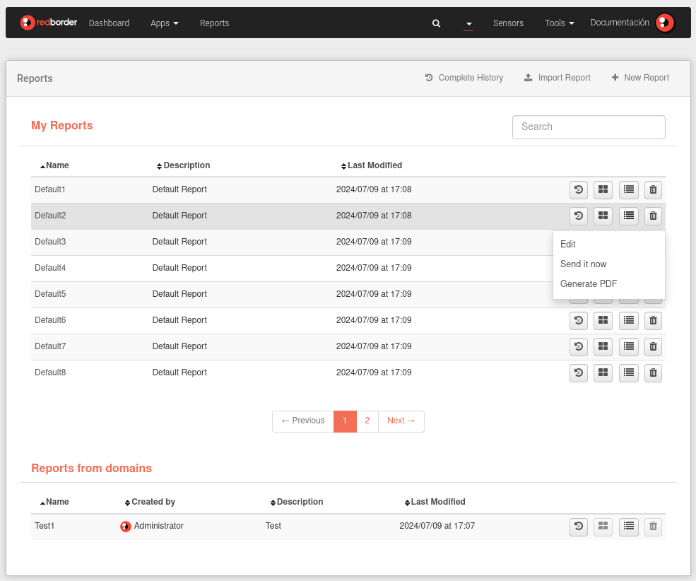
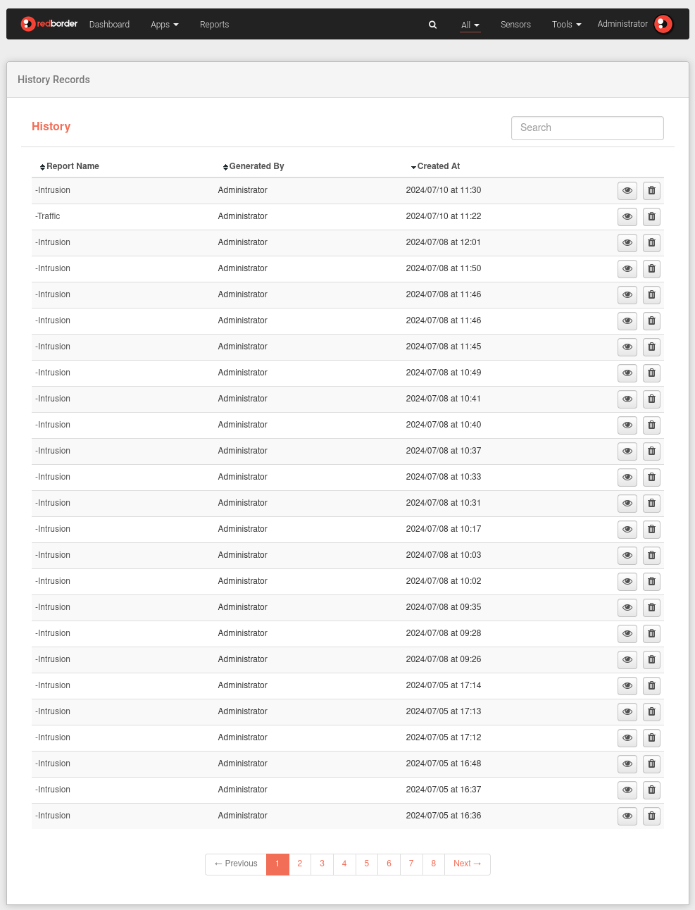
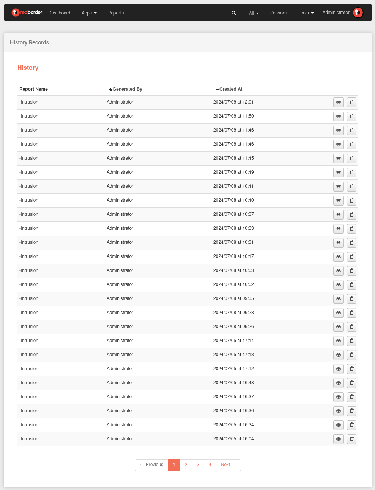

# Modules

In the **Events Section**, the user can **display, analyze, and manage** the events collected by the sensors.

RedBorder offers maximum network visibility thanks to the many options for data representation and visualization provided by our Apps.

The platform has a module for each functionality. Each one uses different technologies and has an independent interface. All modules need a sensor to provide them with data.

## Business Intelligence

The **Business Intelligence** module uses customer information through BI sensors. It can be used to obtain responses to questionnaires defined on the **[RBMobility](https://rbmobility.redborder.com)** platform.

This module is disabled by default, to activate it, run the following command from the console:

    rb_set_modules bi:1; chef_client

BI module

## Malware (WIP)

The **Malware** module is a complete solution for detecting malicious files, IP addresses, and URLs. Multiple detection engines and reputation services are employed, going beyond signature-based policies and similar techniques.

This module is disabled by default, to activate it, run the following command from the console:

    rb_set_modules malware:1; rb_set_malware_mode enable logstash; chef_client

Malware Module

## Traffic

The **Traffic** module uses NetFlow to extract information about all the sensor's traffic. The module provides information such as IPs, protocols, locations, and much more.

Traffic Module

## Intrusion

The **Intrusion** module uses data from the sensor or IPS sensors to display intrusion events based on Snort rules. Also, thanks to the different views included in RedBorder, it is possible to analyze the packets that matched the rule specification.

Intrusion Module

## Monitor

The **Monitor** module uses data from SNMP, Redfish, and IPMI protocols to display the status of the infrastructure.

Monitor Module

## Vault

The **Vault** module uses syslog data to provide information about events from different sources, such as category, target, event action, and more.

It is also possible to enhance the capabilities of the Vault module through extensions that add compatibility with other manufacturers.

Vault Module

## Mobility

The **Mobility** module provides location information for AP sensors in the network. It can be used to show how people move around in a building.

Mobility Module

## Wireless

The **Wireless** module provides an analysis of visitor data from AP network sensors **without taking into account movement calculations**.

This module is disabled by default, to activate it, run the following command from the console:

    rb_set_modules wireless:1; chef_client

Wireless Module

## Reports

The **Reports** module allows the user to create periodic reports with the information provided by the Redborder platform.

To create a new report, click on the *New Report* button and fill in all required fields. You also have the option to import a report from a file using the *Import Report* button. At the same time, next to it you have a button to view the complete history of all reports you have access to.

To search for reports, enter part of the report name or description in the search bar and press the "Enter" or "Enter" key. In addition, you can sort the reports by clicking on the column header of the column by which you want to sort; the reports will be sorted alternately in descending or ascending order.

Reports Module

In the report list, you can view the report history, edit an existing report, generate a PDF or send it by e-mail. All these options are available from the edit button on the right side of the list.

During the creation of a new report, you can select parameters such as schedule type, share with specific users or share with domains. Once the report is created, it will appear in the list of reports mentioned above.

Editing and Creating Reports

In the composition view, the user can edit the report and add new widgets by pressing the *Add Block* button. If we grab the widget from the title bar at the top, we will be able to move it. In the lower right corner of each widget, the cursor will change shape, allowing you to change the size of the widget.

Report Composition

When generating a report, a new window will open in which, after a few seconds of loading, the report will be rendered in PDF format. The user will be able to download the report by pressing the *Print* icon  located at the top right of the screen.

Report generation

### Report history

Each time a PDF report is generated, this action will be recorded in the report history, including the time and date of generation, the report generated and the user who generated it.
The user also has the possibility to view the reports that have been previously exported, either by himself or by other users.

In this section you have at your disposal all the PDF records generated from the reports to which you have access. You can sort the history by clicking on the column names and search for generated report records. You can also view the generated PDF by clicking on the corresponding button. Users with the administrator role have the possibility to delete generated report records.

Complete History

In this section you can view all generated PDFs of the specific report you have selected. It is very similar to the previous view.

Report History
