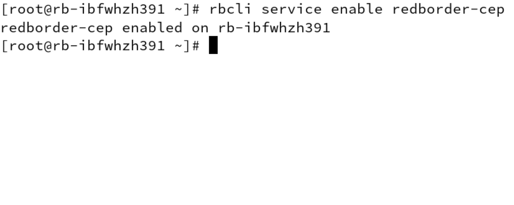
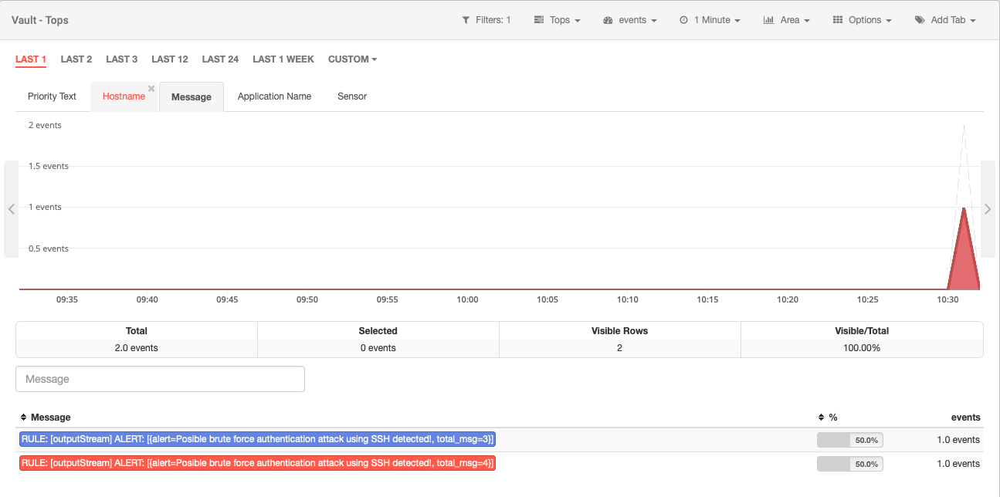

# Ataques de fuerza bruta SSH

En este caso, queremos proteger y monitorear un servidor *SSH* crítico, por lo que utilizaremos reglas **Siddhi** para rastrear cualquier tipo de ataque de fuerza bruta.

Una vez que tenemos configurado el servidor *SSH* y ya hemos creado un sensor para él en Redborder, necesitamos habilitar el motor de correlación.

Para habilitar el **Motor de Correlación**, debemos introducir  `rbcli service enable redborder-cep` en la terminal del administrador.

Ataque de fuerza bruta SSH: habilitar el motor de correlación

Después de eso tendremos que esperar aproximadamente 10 minutos para asegurarnos de que CEP se esté ejecutando. Podemos usar el comando `rbcli service` para verificar esto.

Ataque de fuerza bruta SSH: motor de correlación habilitado

Después de eso, ahora podemos ir a las **Reglas del motor de correlación** desde el menú **Herramientas**.

Usaremos la regla Siddhi de fuerza bruta SSH.

Ataque de fuerza bruta SSH: reglas SSH

Podemos ver la regla haciendo clic en el botón de edición a la derecha.

Ataque de fuerza bruta SSH: edición de la regla SSH

Vamos a cambiar el número máximo de intentos a 3, para esto, debemos cambiar el campo `total_msg` para que contenga `total_msg>=3`.

Ataque de fuerza bruta SSH: edición de la regla SSH

Después de eso, debemos marcar la casilla de habilitación de la regla y aplicar todos los cambios.

Ataque de fuerza bruta SSH: aplicar cambios

En el módulo **Vault** veremos el sensor CEP.

Ataque de fuerza bruta SSH: sensor CEP

Podemos filtrar por sensor CEP para ver los mensajes.

Ataque de fuerza bruta SSH: sensor CEP filtrado

En la pestaña de mensajes podemos ver los mensajes del sensor CEP, que muestra que está alertando de que se está realizando un ataque de fuerza bruta.

Ataque de fuerza bruta SSH: mensajes CEP

!!! info "Ten en cuenta..."

    El motor de correlación tiene un gran potencial debido a las reglas Siddhi. Las reglas predeterminadas incluidas en el administrador se pueden editar para adaptarlas a sus propósitos o crear otras nuevas.
