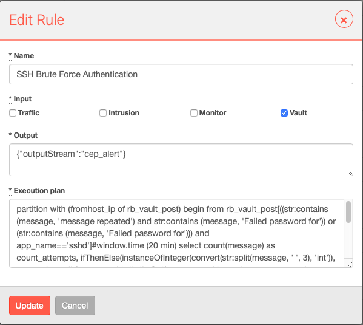
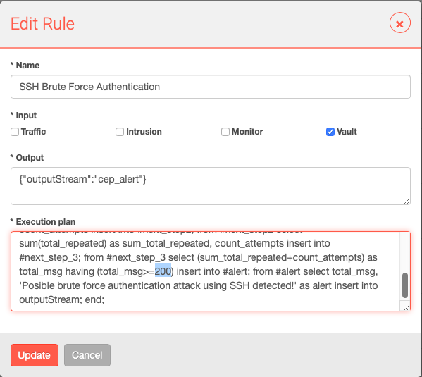
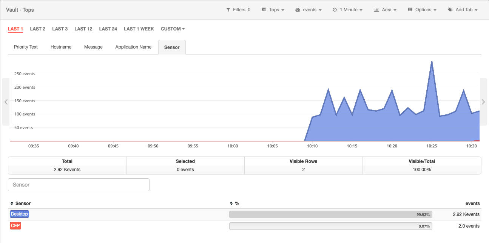
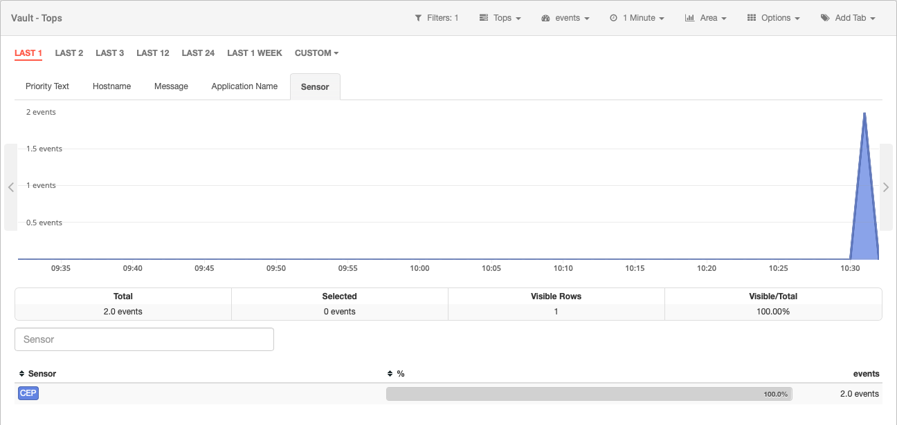

# SSH Brute-Force Attacks

In this case, we want to protect and monitor a critical *SSH* server, so we will use **Siddhi** rules to track any kind of brute-force attack.

Once we have the *SSH* server configured and we have already created a sensor for it in Redborder, we need to enable the Correlation Engine.

To enable the **Correlation Engine**, we have to introduce `rbcli service enable redborder-cep` in the manager terminal.

SSH brute-force attack: enabling correlation engine

After that, we will have to wait 10 minutes approximately to ensure that CEP is running. We can use the `rbcli service` command to verify that.

SSH brute-force attack: correlation engine enabled

Now we can go to **Correlation Engine Rules** from the **Tools** menu. We will use the SSH brute-force Siddhi rule.

SSH brute-force attack: SSH rules

We can see the rule by clicking the edit button on the right.

SSH brute-force attack: editing SSH rule

We are going to change the maximum number of attempts to 3.

SSH brute-force attack: editing SSH rule

After that, we must check the enable box of the rule and apply all the changes.

SSH brute-force attack: applying changes

In the Vault module, we will see the CEP sensor.

SSH brute-force attack: CEP sensor

We can filter by CEP sensor to see the messages.

SSH brute-force attack: CEP sensor filtered

In the message tab, we can see the messages from the CEP sensor, which shows it is alerting that a brute-force attack is being done.

SSH brute-force attack: CEP messages

!!! info "Keep in mind..."

    The correlation engine has a big potential due to Siddhi rules. The default rules included in the manager can be edited to adapt them to your purposes or create new ones.
